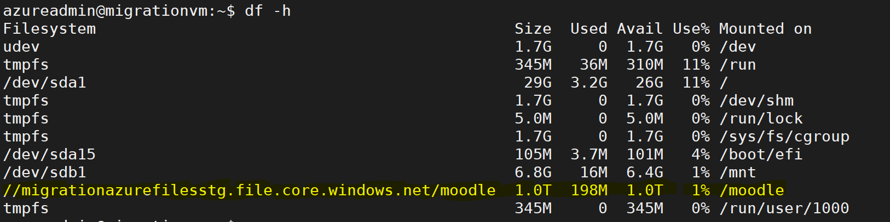

## Azure Premium Files Manual Mounting
-   This document explains how to mount a file share. 
## Prerequisites
-   Azure Storage account created.
-   Azure storage account name and key should be handy.
-   A File Share to be created under the same Storage account.
   
-   **Create File Storage:**
    -   Login to your same Azure subscription and go the same Resource Group.
    -   Select the  Azure created storage resource from the resource group.
    -   Go to the storage account & click on the file storage.
    -   Now click on + File Share button to create a File Share.
    -   Fill the below parameters and create a file share
        •	Enter the name of file storage
        •	Select the capacity of file storage in the GiB
        •	Click on create 
    -   Azure CLI Command to create Azure File Share
        ```
        az storage share create --name moodle --account-name $storageAccountName --account-key $storageAccountKey --quota $diskSize
        ```
    -   It will create a file share with given name and given capacity.

-   **Mount Manually:**
    -   Now login into Virtual Machine where you want to mount Azure Files and run the following steps.
            Note: Make sure that Azure Premium Files should be created before running the below steps.
    -   Install cifs with the following command.
        ``` 
        sudo apt-get -y --force-yes install cifs-utils
        ```
    -   Get the storageAccountName and storageAccountKey from Azure Portal.
        -   Go to the storage account and navigete to Access Keys in left panel.
        -   storageAccountName : Storage account name
        -   storageAccountKey : key1
-   **Set up and Mount Azure Files Share:**
    -   Create a credentials file with the moodle_azure_files.credential name.
    -   Run the following commands.
        ```
        # Replace gathered $storageAccountName and Key values in the below command.
        
        cat <<EOF > /etc/moodle_azure_files.credential
        username=$storageAccountName
        password=$storageAccountKey
        EOF
        chmod 600 /etc/moodle_azure_files.credential
        ```
    -   It will create a file and change the permissions.
    -   Now run the following commands to set the azure premium files to fstab file.
    -   Create a shell file “fstab_entry.sh” with the below command.
        ```
        nano /home/azureadmin/fstab_entry.sh
        # Above command will create a new file and copy below lines to the file and save it.
        ```
        - Add the below command in the newly created file.
        ```
            #!/bin/bash
            grep -q -s "^//$storageAccountName.file.core.windows.net/moodle\s\s*/moodle\s\s*cifs" /etc/fstab && _RET=$? || _RET=$?
            if [ $_RET != "0" ]; then
                echo -e "\n//storageAccountName.file.core.windows.net/FileStorageName   /moodle cifs    credentials=/etc/moodle_azure_files.credential,uid=www-data,gid=www-data,nofail,vers=3.0,dir_mode=0770,file_mode=0660,serverino,mfsymlinks" >> /etc/fstab
            fi
            mkdir -p /moodle
            mount /moodle
        ```

        - Save the file by following command.
        ```
        # Press ctrl + O and press enter
        # Press ctrl + X to come out of file.            
        ```
    -   Run the fstab_entry.sh file with following command and Azure Premium Files will be mounted successfully.
        ```
        bash /home/azureadmin/fstab_entry.sh
        ```

    -   Check the list of mounted systems.
        ```
        df -h
        ```
    - After running the above command Mounted Azure Files should be like as shown below.
    
    - With the above steps mounting of Azure Files is completed.

