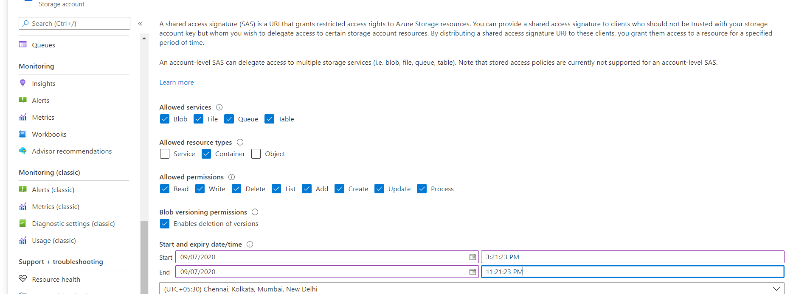
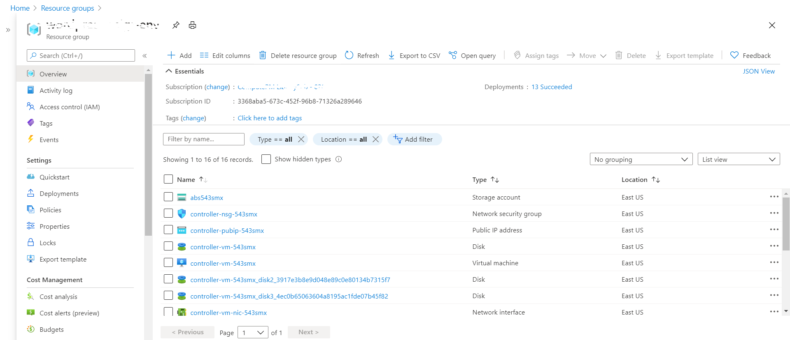

## Moodle Manual Migration
- This document explains how to migrate Moodle application from an on-premises environment to Azure. 
- For each of the steps, you have two approaches provided.
    - One that lets you to use Azure Portal. 
    - Other that lets you accomplish the same tasks on a command line using Azure CLI.
### Option 1: Migrating Moodle using ARM Template  
- Migration of Moodle with an ARM template creates the infrastructure in Azure.
- Once the infrastructure is created, the Moodle software stack and associated dependencies are migrated.
## Prerequisites
- If the versions of the software stack deployed on-premises are lagging with respect to the versions supported in this guide, the expectation is that the on-premises versions will be updated/patched to the versions listed in this guide.
- Must have access to the on-premises infrastructure to take backup of Moodle deployment and configurations (including DB configurations).
- Azure subscription and Azure Blob storage should be created prior to migration.
- Make sure to have Azure CLI and AzCopy handy.
- Make sure Moodle website should be in maintenance mode.
- This migration guide supports the following software versions:   
     - Ubuntu 16.04 LTS
     - Nginx 1.10.3
     - MySQL 5.6, 5.7 or 8.0 database server (This guide uses Azure Database for MYSQL)
     - PHP 7.2, 7.3, or 7.4
     - Moodle 3.8 & 3.9
## Migration Approach
-   Migration of Moodle application to Azure is broken down in the following three stages:
    - Pre-migration tasks.
    - Actual migration of the application.
    - Post-migration tasks.
-   **Pre-Migration**
    
    - Data Export from on-premises to Azure involves the following tasks.
        -   Install Azure CLI.
        -   Have an Azure subscription handy.
        -   Create a Resource Group inside Azure.
        -   Create a Storage Account inside Azure.
        -   Backup all relevant data from on-premises infrastructure.
        -   Ensure the on-premises database instance has mysql-client installed.
        -   Copy backup archive file (such as storage.tar.gz) to Blob storage on Azure.
-   **Migration**
    
    - Actual migration tasks involve the migration of application and all data.
    - Deploy infrastructure on Azure using Moodle ARM template.
    - Copy over the backup archive (storage.tar.gz) to the moodle controller instance from the ARM deployment.
    - Setup Moodle controller instance and worker nodes. 
    - Data migration tasks.
       
-   **Post Migration**
    
    - Post migration tasks that include application configuration.
    - Update general configuration (e.g. log file destinations).
    - Update any cron jobs / scheduled tasks.
    - Configuring certificates.
    - Restarting PHP and nginx servers.
    - Mapping DNS name with the Load Balancer public IP.
## Pre-Migration
-   **Data Export from on-premises to Azure Cloud:**
    -   **Install Azure CLI**
        -   Install Azure CLI on a host inside the on-premises infrastructure for all Azure related tasks.
            ```
            curl -sL https://aka.ms/InstallAzureCLIDeb | sudo bash
            ```
        -   Now login into your Azure account
            ```
            az login
            ```
         - az login: Azure CLI will quite likely launch an instance or a tab inside your default web-browser and prompt you to login to Azure using your Microsoft Account.
          - If the above browser launch does not happen, open a browser page at  [https://aka.ms/devicelogin](https://aka.ms/devicelogin) and enter the authorization code displayed in your terminal.
        -  To use command line use below command.
            ```
            az login -u <username> -p <password>
            ```
    
    -   **Create Subscription:**
        - If you have a subscription handy skip this step.
        - And if you do not have a subscription, you can choose to [create one within the Azure Portal](https://ms.portal.azure.com/#blade/Microsoft_Azure_Billing/SubscriptionsBlade) or opt for a [Pay-As-You-Go](https://azure.microsoft.com/en-us/offers/ms-azr-0003p/)
        - To create the subscription using azure portal, navigate to Subscription from Home section.
        

        
    -   **Create Resource Group:**
        - Once you have a subscription handy, you will need to create a Resource Group.
        - One option is to create resource group using Azure portal.
        - Navigate to home section and search for resource group, after clicking on add fill the mandatory fields and click on create.
        
        - Alternatively, you can use the Azure CLI command to create a resource group.
        - Provide the same default Location provided in previous steps.
        - More details on [Location in Azure](https://azure.microsoft.com/en-in/global-infrastructure/data-residency/).
            ```
            az group create -l location -n name -s Subscription_NAME_OR_ID
            # Update the screenshot and subscription name with sample test account

            # example: az group create -l eastus -n manual_migration -s FreeTrail
            ```
         - In above step resource group is created as "manual_migration". Use the same resource group in further steps.
    -   **Create Storage Account:**
        -  The next step would be to [create a Storage Account](https://ms.portal.azure.com/#create/Microsoft.StorageAccount) in the Resource Group you've just created.
        - Storage account can also be created using Azure portal or Azure CLI command.
        - To create using portal, navigate to portal and search for storage account and click on Add button.
        - After filling the mandatory details, click on create.
        
        - Alternatively, you can use Azure CLI command 
            ```
            az storage account create -n storageAccountName -g resourceGroupName --sku Standard_LRS --kind BlobStorage -l location

            example: az storage account create -n onpremisesstorage -g manual_migration --sku Standard_LRS --kind BlobStorage -l eastus
            ```
        - Once the storage account "onpremisesstorage" is created, this is used as the destination to take the on-premises backup.
    
    -   **Backup of on-premises data:**
        - Take backup of on-premises data such as moodle, moodledata, configurations and database backup file to a single directory. The following illustration should give you a good idea.

	    

        - First create a empty storage directory in any desired location to copy all the data.

            ```
            sudo -s
            # for example the location is /home/azureadmin
            cd /home/azureadmin
            mkdir storage
            ```

    - **Backup of moodle and moodledata**
        - The moodle directory consists of site HTML content and moodledata contains moodle site data.

        ```
        #commands to copy moodle and moodledata 
        cp -R /var/www/html/moodle /home/azureadmin/storage/
        cp -R /var/moodledata /home/azureadmin/storage/
        ```
	- **Backup of PHP and webserver configuration**
		- Copy the PHP configuration files such as php-fpm.conf, php.ini, pool.d and conf.d directory to phpconfig directory under the configuration directory.
		- Copy the ngnix configuration such as nginx.conf, sites-enabled/dns.conf to the nginxconfig directory under the configuration directory.
            ```
            cd /home/azureadmin/storage
            mkdir configuration
            # command to copy nginx and php configuration
            cp -R /etc/nginx /home/azureadmin/storage/configuration/nginx
            cp -R /etc/php /home/azureadmin/storage/configuration/php
            ```
		- If the web-server used is Apache instead, copy all the relevant configuration for Apache to the configuration directory.

	- **Create a backup of database**
		- If you already have mysql-client installed ,skip the step to install mysql-client.
		- If you do not have mysql-client installed on the database instance, now would be a good time to do that.
			```
			sudo -s
			# command to check mysql-client is installed or not
			mysql -V
			
            # if the mysql-client is not installed, install the same by following command.
			sudo apt-get install mysql-client
			
            #following command will allow to you to take the backup of database.
			mysqldump -h dbServerName -u dbUserId -pdbPassword dbName > /home/azureadmin/storage/database.sql
			# Replace dbServerName, dbUserId, dbPassword and bdName with on-premises database details
			```

	- Create an archive tar.gz file of backup directory.
        ```
        cd  /home/azureadmin/
        tar -zcvf storage.tar.gz storage
    	```

    -   **Download and install AzCopy**
        - Execute the below commands to install AzCopy
        ```
        sudo -s
        wget https://aka.ms/downloadazcopy-v10-linux
        tar -xvf downloadazcopy-v10-linux
        sudo rm /usr/bin/azcopy
        sudo cp ./azcopy_linux_amd64_*/azcopy /usr/bin/
        ```

    -   **Copy Archive file to Blob storage**
        - Copy the on-premises archive file to blob storage using AzCopy.
        - To use AzCopy, user should generate SAS Token first.
        - Go to the created Storage Account Resource and navigate to Shared access signature in the left panel.

            
        - Select the Container, object checkboxes and set the start, expiry date of the SAS token. Click on "Generate SAS and Connection String".

            
        
        - Copy and save the SAS token for further use.
        
        - Command to create a container in the storage account.
            ```
            az storage container create --account-name <storageAccontName> --name <containerName> --auth-mode login

            Example: az storage container create --account-name onpremisesstorage --name migration --auth-mode login

            # --auth-mode login means authentication mode as login, after login the container will be created.
            ```
        -   Command to copy archive file to blob storage.
        
            ```
            sudo azcopy copy '/home/azureadmin/storage.tar.gz' 'https://<storageAccountName>.blob.core.windows.net/<containerName>/<SAStoken>

            Example: azcopy copy '/home/azureadmin/storage.tar.gz' 'https://onpremisesstorage.blob.core.windows.net/migration/?sv=2019-12-12&ss='
            ```
        -  Now, you should have a copy of your archive inside the Azure blob storage account.
## Migration
### Migrating Moodle with Azure ARM Templates 
- Deploying Azure infrastructure using ARM template.
- When using an ARM template to deploy infrastructure on Azure, you have a couple of available options.
- A pre-defined deployment size using one of the four pre-defined Moodle sizes.
- A fully configurable deployment that gives more flexibility and choice around deployments.
- The 4 predefined templates options such as Minimal, Short-to-Mid, Large, Maximal are available on [GitHub repository](https://github.com/Azure/Moodle).
    - [Minimal](https://portal.azure.com/#create/Microsoft.Template/uri/https%3A%2F%2Fraw.githubusercontent.com%2FAzure%2FMoodle%2Fmaster%2Fazuredeploy-minimal.json): This deployment will use NFS, MySQL, and smaller auto scale web frontend VM sku (1 vCore) that will give faster deployment time (less than 30 minutes) and requires only 2 VM cores currently that will fit even in a free trial Azure subscription.  
    - [Small to Mid](https://portal.azure.com/#create/Microsoft.Template/uri/https%3A%2F%2Fraw.githubusercontent.com%2FAzure%2FMoodle%2Fmaster%2Fazuredeploy-small2mid-noha.json): Supporting up to 1000 concurrent users. This deployment will use NFS (no high availability) and MySQL (8 vCores), without other options like elastic search or Redis cache.  
    - [Large (high availability)](https://portal.azure.com/#create/Microsoft.Template/uri/https%3A%2F%2Fraw.githubusercontent.com%2FAzure%2FMoodle%2Fmaster%2Fazuredeploy-large-ha.json): Supporting more than 2000 concurrent users. This deployment will use Azure Files, MySQL (16 vCores) and Redis cache, without other options like elastic search.  
    - [Maximum](https://portal.azure.com/#create/Microsoft.Template/uri/https%3A%2F%2Fraw.githubusercontent.com%2FAzure%2FMoodle%2Fmaster%2Fazuredeploy-maximal.json): This maximal deployment will use Azure Files, MySQL with highest SKU, Redis cache, elastic search (3 VMs), and pretty large storage sizes (both data disks and DB).
- To deploy any of the predefined size template click on the launch option.  
- It will redirect to Azure Portal where user need to fill mandatory fields such as Subscription, Resource Group, [SSH key](https://docs.github.com/en/github/authenticating-to-github/generating-a-new-ssh-key-and-adding-it-to-the-ssh-agent), Region. 

- Click on purchase to start the deployment of Moodle on Azure. Link for [pricing calculator]( https://azure.microsoft.com/en-us/pricing/calculator/ ).
- The following diagram will give an idea about Moodle architecture.

- The deployment will install supported Infrastructure and Moodle.
    - Moodle version: 3.8 and 3.9
    - Webserver: nginx 1.10.0
    - PHP version: 7.4, 7.3 or 7.2 
    - Database server type: MySQL  
    - MySQL version: 5.6, 5.7 and 8.0 
    - Ubuntu version: 16.04-LTS  
 <details>
  <summary>When the ARM template is used, the following resources are created within Azure (click to expand!)</summary>
  
- **Network Template:** Network Template will create virtual network, Network Security Group, Network Interface, subnet, Public IP, Load Balancer/App gateway and Redis cache etc. 
     - Creates a virtual network with string as name, apiVersion, Location and DNS server name.
     - The AddressSpace that contains an array of IP address ranges that can be used by subnets.
   
    - **Virtual network:** An Azure Virtual Network is a representation of your own network in the cloud. It is a logical isolation of the Azure cloud dedicated to your subscription. When you create a Vnet, your services and VMs within your Vnet can communicate directly and securely with each other in the cloud. More details [Virtual Network](https://docs.microsoft.com/en-us/azure/virtual-network/virtual-networks-overview).
    - **Network Security Group:** A network security group (NSG) is a networking filter (firewall) containing a list of security rules allowing or denying network traffic to resources connected to Azure Vnets. For more details [network security group](https://docs.microsoft.com/en-us/azure/virtual-network/security-overview).
    -   **Network Interface:** A network interface enables an Azure Virtual Machine to communicate with internet, Azure and on-premises resources. For more details [network interface](https://docs.microsoft.com/en-us/azure/virtual-network/virtual-network-netwAork-interface).
    - **Subnet:** A subnet or subnetwork is a smaller network inside a large network. By default, an IP in a subnet can communicate with any other IP inside the Vnet. More details[Subnet](https://docs.microsoft.com/en-us/azure/virtual-network/virtual-network-manage-subnet). 
    - **Public IP:** Public IP addresses are used to communicate Azure resources to the Internet. The address is dedicated to the Azure resource. More details [Public IP](https://docs.microsoft.com/en-us/azure/virtual-network/public-ip-addresses#:~:text=Public%20IP%20addresses%20enable%20Azure,IP%20assigned%20can%20communicate%20outbound). 
    - **Load Balancer:** It is an efficient distribution of network or application traffic across multiple servers in a server farm. Ensures high availability and reliability by sending requests only to servers that are online. More details [Load balancer](https://docs.microsoft.com/en-us/azure/virtual-machines/windows/tutorial-load-balancer#:~:text=An%20Azure%20load%20balancer%20is,traffic%20to%20an%20operational%20VM). 
    - ***Note***: Any of the 4 pre-defined template will deploy Azure Load Balancer, only in Fully Configurable deployment user has choice to choose App Gateway instead of Load Balancer.
    -  **Azure Application Gateway**: It is a web traffic load balancer that enables you to manage traffic to your web applications. Application Gateway can make routing decisions based on additional attributes of an HTTP request, for example URI path or host headers. More details [App Gateway](https://docs.microsoft.com/en-us/azure/application-gateway/overview). 
    - **Redis Cache:** Azure Cache for Redis provides an in-memory data store based on the open-source software Redis. Redis improves the performance and scalability of an application that uses on backend data stores heavily. It is able to process large volumes of application request by keeping frequently accessed data in the server memory that can be written to and read from quickly. For more details [redis cache](https://docs.microsoft.com/en-us/azure/azure-cache-for-redis/cache-overview). 
- **Storage Template:**  
    -  storage account template will create a storage account with File Storage Kind and Premium LRS replication, Size of 1TB. For more details on [storage account](https://docs.microsoft.com/en-us/azure/storage/common/storage-account-overview). 
    -   As per the predefined template, storage account with Azure files creates File Share.
    -   An Azure storage account contains all of your Azure Storage data objects: blobs, files, queues, tables, and disks. The storage account provides a unique namespace for your Azure Storage data that is accessible from anywhere in the world over HTTP or HTTPS.
    - The types of storage accounts are General-purpose V2, General-purpose V1, BlockBlobStorage, File Storage, BlobStorage accounts.
    - Types of Replication are Locally-redundant storage (LRS), Zone-redundant storage (ZRS), Geo redundant storage (GRS).
    - Types of Performance are Standard, Premium.
    - Size(sku):  A single storage account can store up to 500 TB of data and like any other Azure service.
    - Below are types of storage account types ARM template support. 
        - NFS: A Network File System (NFS) allows remote hosts to mount file systems over a network and interact with those file systems as though they are mounted locally. This enables system administrators to consolidate resources onto centralized servers on the network. More details on [NFS](https://docs.microsoft.com/en-us/windows-server/storage/nfs/nfs-overview). 
        - GluserFS: It is an open source distributed file system that can scale out in building-block fashion to store multiple petabytes of data. More details on [Gluster FS](https://docs.microsoft.com/en-us/azure/virtual-machines/workloads/sap/high-availability-guide-rhel-glusterfs). 
        - Azure Files: It is the only public cloud file storage that delivers secure, Server Message Block (SMB) based, fully managed cloud file shares that can also be cached on-premises for performance and compatibility. More details on [Azure Files](https://docs.microsoft.com/en-us/azure/storage/files/storage-files-introduction). 
            - NFS and glusterFS:  
                - Replication is standard Locally-redundant storage (LRS).  
                - Type is Storage (general purpose v1).
            - Azure Files:  
                - Replication is Premium Locally-redundant storage (LRS).  
                - Type is File Storage.
            - These storage mechanisms will differ according to deployment selected such as:
                - NFS and glusterFS will create a container.  
                - Azure files will create a file share. 
    -  For Minimal and short2mid the template will support nfs and for Large and Maximal the template will support AzureFiles.
    - To access the containers and file share etc. navigate to storage account in resource group in the portal. 
    
- **Database Template:** 
    - This Database template will create an [Azure Database for MySQL server](https://docs.microsoft.com/en-in/azure/mysql/).
    - Azure Database for MySQL is easy to set up, manage and scale. It automates the management and maintenance of your infrastructure and database server, including routine updates, backups and security. Build with the latest community edition of MySQL, including versions 5.6, 5.7 and 8.0.
    - To access the database server created navigate to the resource group provided while deployment and go to Azure Database for MySQL server.  
    - The database server will have a server name, server admin login name, MySQL version, and Performance Configuration. 
    
        
- **Virtual Machine Template:** This template will create a Virtual Machine.
    - Controller VM: 
        - The OS used at this time is Ubuntu 16.04.
    - VM extension: 
        - Extension can be small applications that provide post-deployment configuration and automation tasks on [Azure VMs](https://docs.microsoft.com/en-us/azure/virtual-machines/extensions/overview).
        - VM extension will executes a shell script file which installs Moodle on the Virtual Machine and captures the log files. 
        - Log files stderr and stdout are created at the /var/lib/waagent/custom-script/download/0/  
        - User can view the log files as a root user. 
- **Scale Set Template**: 
    -   This template will create a [Virtual Machine Scale Set.](https://docs.microsoft.com/en-us/azure/virtual-machine-scale-sets/overview). 
    - A virtual machine scale set allows you to deploy and manage a set of auto-scaling virtual machines. You can scale the number of VMs in the scale set manually or define rules to auto scale based on resource usage like CPU, memory demand, or network traffic.
    - Autoscaling of VM Instances depends on [CPU utilization.](https://docs.microsoft.com/en-us/azure/azure-monitor/platform/autoscale-overview).  
    - While scaling up an instance a VM is deployed and a shell script is executed to install the Moodle prerequisites and setting up cron jobs. 
    - VM instances have Private IP. 
    - For connecting to VMs on Scale Set with private IP, follow the steps written in the [document](https://github.com/asift91/Manual_Migration/blob/master/vpngateway.md). 
    
</details>

-   ### Manual Moodle migration follow the below steps 
    - After completion of deployment, go to the resource group. 
    - The following image will give some idea on how the resources will be created.
    
    - Update the moodle directory and configuration in both the controller virtual machine and virtual machine scale set instance.
-  **Virtual Machine**
    - Login into this controller machine using any of the free open-source terminal emulator or serial console tools. 
        - Copy the public IP of controller VM to use as the hostname.
        - Expand SSH in navigation panel and click on Auth and browse the same SSH key file given while deploying the Azure infrastructure using the ARM template.
        - Click on Open and it will prompt to give the username. Give it as azureadmin as it is hard coded in template.
        
        
        - [Putty general FAQ/troubleshooting questions](https://documentation.help/PuTTY/faq.html).
        - Browse and select the SSH key and click on Open button.
        - After the login, run the following set of commands to migrate. 
        -   **Download and install AzCopy**
            - Execute the below commands to install AzCopy
                ```
                sudo -s
                wget https://aka.ms/downloadazcopy-v10-linux
                tar -xvf downloadazcopy-v10-linux
                sudo rm /usr/bin/azcopy
                sudo cp ./azcopy_linux_amd64_*/azcopy /usr/bin/
                ```
            - Download the on-premises backup data from Azure Blob storage to VM such as moodle, moodledata, configuration directory with database backup file to /home/azureadmin location. 
            -   Download the compressed backup file from blob storage to virtual Machine at /home/azureadmin/ location.
                ```
                sudo -s
                cd /home/azureadmin/
                azcopy copy 'https://storageaccount.blob.core.windows.net/container/BlobDirectoryName<SASToken>' '/home/azureadmin/'

                Example: azcopy copy 'https://onpremisesstorage.blob.core.windows.net/migration/storage.tar.gz?sv=2019-12-12&ss=' '/home/azureadmin/storage.tar.gz'
                ```
            - Extract the compressed content to a directory.
                ```
                cd /home/azureadmin
                tar -zxvf storage.tar.gz --directory /home/azureadmin
                ```
        -   A backup directory is extracted as storage/ at /home/azureadmin.
        - This storage directory contains moodle, moodledata and configuration directory along with database backup file. These will be copied to desired locations.
        - Create a backup directory.
            ```
            cd /home/azureadmin/
            mkdir -p backup
            mkdir -p backup/moodle
            mkdir -p backup/moodle/html
            ```
        - Replace the moodle directory.
            - Copy and replace this moodle directory with existing directory (/home/azureadmin/storage/moodle/html) to existing moodle html path (/moodle/html/moodle).
            
                ```
                mv /moodle/html/moodle /home/azureadmin/backup/moodle/html/moodle
                cp -rf /home/azureadmin/storage/moodle /moodle/html/
                ```
        - Replace the moodledata directory.
            - Copy and replace this moodledata (/moodle/moodledata) directory with existing moodledata directory.
            
                ```
                mv /moodle/moodledata /home/azureadmin/backup/moodle/moodledata
                cp -rf /home/azureadmin/storage/moodledata /moodle/moodledata
                ``` 
        - Importing the moodle Database to Azure moodle DB.
            -   Import the on-premises database to Azure Database for MySQL.
            - Create a database to import on-premises database.
                ```    
                mysql -h $server_name -u $server_admin_login_name -p$admin_password -e "CREATE DATABASE $moodledbname CHARACTER SET utf8;"
                ```
            - Assign right permissions to database.
                ```
                mysql -h $server_name -u $server_admin_login_name -p$admin_password -e "GRANT ALL ON $moodledbname.* TO $moodledbuser IDENTIFIED BY '$moodledbpass';"
                ``` 
            - Import the database.
                ```
                mysql -h $server_name -u $server_admin_login_name -p$admin_password $moodledbname < /home/azureadmin/storage/database.sql
                ```
            - *Note:* 
                - Update above $server_name , $server_admin_login_name values from created Azure Database for MySQL server within the same Resource Group in Azure Portal.
                - $moodledbname, $moodledbuser and $moodledbpass can be newly created by the user.
                - $admin_password can be reset from the Azure portal.
                - Go to the created Azure Database for MySQL server and click on "Reset Password" button at the top left of the page.
            - [Database general FAQ/troubleshooting questions](https://www.digitalocean.com/docs/databases/mysql/resources/troubleshoot-connections/)
        
        - Configure directory permissions.
            - Set 755 and www-data owner:group permissions to moodle directory.
                ```
                sudo chmod 755 /moodle
                sudo chown -R www-data:www-data /moodle/html/moodle
                ```
            - Set 770 and www-data owner:group permissions to moodledata directory.
                ```
                sudo chmod 770 /moodle/moodledata
                sudo chown -R www-data:www-data /moodle/moodledata
                ``` 
        - Change the database details in moodle configuration file (/moodle/config.php).
        - Update the following parameters in config.php.
            - dbhost, dbname, dbuser, dbpass, dataroot and wwwroot
                ```
                cd /moodle/html/moodle/
                vi config.php
                # update the database details and save the file.
                ```
        - Update the nginx conf file.
            ```
            sudo mv /etc/nginx/sites-enabled/*.conf  /home/azureadmin/backup/onpremisemoodle.westus.cloudapp.azure.com.conf 
            cd /home/azureadmin/storage/configuration/
            sudo cp -rf nginx/sites-enabled/*.conf  /etc/nginx/sites-enabled/
            ```
        - Update the PHP config file.
            ```
            _PHPVER=`/usr/bin/php -r "echo PHP_VERSION;" | /usr/bin/cut -c 1,2,3`
            echo $_PHPVER
            sudo mv /etc/php/$_PHPVER/fpm/pool.d/www.conf /home/azureadmin/backup/www.conf 
            sudo cp -rf /home/azureadmin/storage/configuration/php/$_PHPVER/fpm/pool.d/www.conf /etc/php/$_PHPVER/fpm/pool.d/ 
            ```
        -   Install Missing PHP extensions.
                - ARM template install the following PHP extensions - fpm, cli, curl, zip, pear, mbstring, dev, mcrypt, soap, json, redis, bcmath, gd, mysql, xmlrpc, intl, xml and bz2.
            - Note: If on-premises has any additional PHP extensions those can be installed manually.
                ```
                sudo apt-get install -y php-<extensionName>
                ```
        
        - Update DNS Name and log files location
            -   Update the Azure cloud DNS name with the on-premises DNS name.
                ```
                nano /etc/nginx/sites-enabled/*.conf
                # Above command will open the configuration file.
                # Update the server name.
                # Example: server_name onpremisemoodle.westus.cloudapp.azure.com;
                # Change to server_name lb-fnulin.eastus.cloudapp.azure.com; 
                # Most of the cases DNS may remain same in the migration.
                # 
                # Change the log path location.
                # Find access_log and error_log and update the log path.
                #
                # After the changes, Save the file. 
                # Press CTRL+o to save and CTRL+x to exit.
                ``` 

        - Restart the webservers.
            ```
            sudo systemctl restart nginx 
            sudo systemctl restart php$_PHPVER-fpm  
            ``` 
           
-   **Virtual Machine Scaleset**
    -   Login to Scaleset VM instance and execute the following sequence of steps.
    - Download the on-premises compressed data from Azure Blob storage to VM such as moodle, moodledata, configuration directories with database backup file to /home/azureadmin location. 
        -   **Download and install AzCopy**
            - Execute the below commands to install AzCopy
                ```
                sudo -s
                wget https://aka.ms/downloadazcopy-v10-linux
                tar -xvf downloadazcopy-v10-linux
                sudo rm /usr/bin/azcopy
                sudo cp ./azcopy_linux_amd64_*/azcopy /usr/bin/
                ```    
        -   Download the compressed backup file to Virtual machine at /home/azureadmin/ location.
            ```
            sudo -s
            cd /home/azureadmin/
            azcopy copy 'https://storageaccount.blob.core.windows.net/container/BlobDirectoryName<SASToken>' '/home/azureadmin/'

            Example: azcopy copy 'https://onpremisesstorage.blob.core.windows.net/migration/storage.tar.gz?sv=2019-12-12&ss=' '/home/azureadmin/storage.tar.gz'
            ```
        - Extract the compressed content to a directory.
            ```
            cd /home/azureadmin
            tar -zxvf storage.tar.gz --directory /home/azureadmin
            ```
    -   A backup directory is extracted as storage/ at /home/azureadmin.
        -   This storage directory contains moodle, moodledata and configuration directory along with database backup file. These will be copied to desired locations.
        - Create a backup directory.
            ```
            cd /home/azureadmin/
            mkdir -p backup
            mkdir -p backup/moodle
            ```
        
        - **Configuring PHP & webserver**
            - Update the nginx conf file.
                ```
                sudo mv /etc/nginx/sites-enabled/<dns>.conf  /home/azureadmin/backup/<dns>.conf 
                cd /home/azureadmin/storage/configuration/
                sudo cp nginx/sites-enabled/<dns>.conf  /etc/nginx/sites-enabled/
                ```
            - Update the php config file.
                ```
                _PHPVER=`/usr/bin/php -r "echo PHP_VERSION;" | /usr/bin/cut -c 1,2,3`
                echo $_PHPVER
                sudo mv /etc/php/$_PHPVER/fpm/pool.d/www.conf /home/azureadmin/backup/www.conf 
                sudo  cp /home/azureadmin/storage/configuration/php/$_PHPVER/fpm/pool.d/www.conf /etc/php/$_PHPVER/fpm/pool.d/ 
                ```
            -   Install Missing PHP extensions.
                    - ARM template install the following PHP extensions.
                        - fpm, cli, curl, zip, pear, mbstring, dev, mcrypt, soap, json, redis, bcmath, gd, mysql, xmlrpc, intl, xml and bz2.
                Note: If on-premises has any additional PHP extensions those will be installed by the user.
                ```
                sudo apt-get install -y php-<extensionName>
                ```
            - Update DNS Name and log files location
                -   Update the Azure cloud DNS name with the on-premises DNS name.
                    ```
                    nano /etc/nginx/sites-enabled/*.conf
                    # Above command will open the configuration file.
                    # Update the server name.
                    # Example: server_name onpremisemoodle.westus.cloudapp.azure.com;
                    # Change to server_name lb-fnulin.eastus.cloudapp.azure.com; 
                    # Most of the cases DNS may remain same in the migration.
                    # 
                    # Change the log path location.
                    # Find access_log and error_log and update the log path.
                    #
                    # After the changes, Save the file. 
                    # Press CTRL+o to save and CTRL+x to exit.
                    ``` 

        
        -   **Restart servers**
            - Update the time-stamp to update the local copy in VMSS instance.
            /usr/local/bin/update_last_modified_time.azlamp.sh.
            - Restart nginx and php-fpm.
                ```
                sudo systemctl restart nginx
                sudo systemctl restart php$_PHPVER-fpm
                # If apache is installed as a webserver then restart apache
                sudo systemctl restart apache
                ```
## Post Migration
- Post migration tasks are around final application configuration that include setup of logging destinations, SSL certificates and scheduled tasks / cron jobs.
-   **Virtual Machine:**
    
    -   **Log Paths**
        
        -   on-premises might be having different log path location and those paths need to be updated with Azure log paths. 
            -   Ex: /var/log/syslogs/moodle/access.log
            -   Ex: /var/log/syslogs/moodle/error.log 
         - Update log files location
                ```
                nano /etc/nginx/sites-enabled/*.conf
                # Above command will open the configuration file.
                # 
                # Change the log path location.
                # Find access_log and error_log and update the log path.
                #
                # After the changes, Save the file. 
                # Press CTRL+o to save and CTRL+x to exit.
                ``` 

    -   **Certs:**
        -   _SSL Certs_: The certificates for your moodle application reside in /moodle/certs.
            -   Copy over the .crt and .key files over to /moodle/certs/. The file names should be changed to nginx.crt and nginx.key in order to be recognized by the configured nginx servers. Depending on your local environment, you may choose to use the utility SCP or a tool like WinSCP to copy these files over to the cluster controller virtual machine.
                -   Command to change the certs name.
                    ```
                    cd /path/to/certs/location
                    mv /path/to/certs/location/*.key /moodle/certs/nginx.key
                    mv /path/to/certs/location/*.crt /moodle/certs/nginx.crt
                    ```
            -   You can also generate a self-signed certificate, useful for testing only.
                
                ```
                openssl req -x509 -nodes -days 365 -newkey rsa:2048 \
                -keyout /moodle/certs/nginx.key \
                -out /moodle/certs/nginx.crt \
                -subj "/C=US/ST=WA/L=Redmond/O=IT/CN=mydomain.com"
                ```
            -   It's recommended that the certificate files be read-only to owner and that these files are owned by www-data:www-data.
                ```
                chown www-data:www-data /moodle/certs/nginx.*
                chmod 400 /moodle/certs/nginx.*
                ```
        -   Update Certs location.
                ```
                nano /etc/nginx/sites-enabled/*.conf
                # Above command will open the configuration file.
                # 
                # Change the certs path location.
                # Find ssl_certificate and update the certs path as below
                # /moodle/certs//moodle/certs/nginx.crt;
                # /moodle/certs/nginx.key;
                #
                # After the changes, Save the file. 
                # Press CTRL+o to save and CTRL+x to exit. 

    -   **Update Time-Stamp:**
        -   A cron job that run in the VMSS instances(s) which will check the updates in time-stamp for every minute. If there is an update in time-stamp then local copy of VMSS is updated in web root directory.
        -   In Virtual Machine scaleset a local copy of moodle site data (/moodle/html/moodle) is copied to its root directory (/var/www/html/).
        -   Update the time-stamp to update the local copy in VMSS instance.
            ```
            sudo -s
            /usr/local/bin/update_last_modified_time.azlamp.sh
            ```
    -   **Restart servers**
        
        -   Restart the nginx and php-fpm servers.
            ```
            sudo systemctl restart nginx
            sudo systemctl restart php<phpVersion>-fpm
            ```
        -   If apache is installed as a webserver then restart apache server.
            ```
            sudo systemctl restart apache
            ```
    -   **Mapping IP:**
        -   DNS name mapping with the load balancer IP must be done at the hosting provider level.
        -   Disable Moodle website from Maintenance mode.
        -   Hit the load balancer DNS name to get the migrated Moodle web page.         

    
