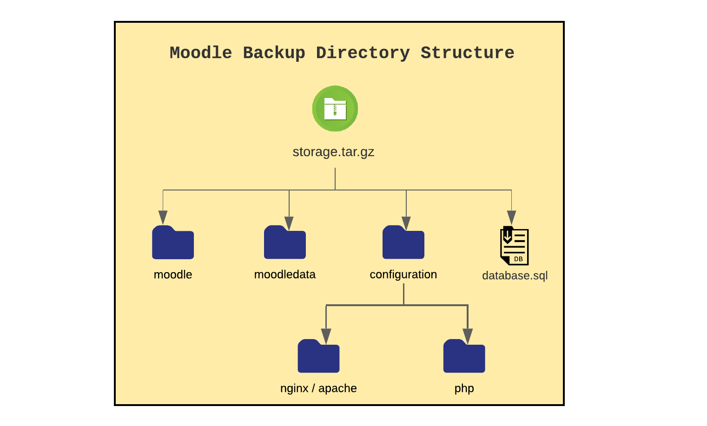

## Moodle Manual  Migration
This document explains how to migrate Moodle from OnPrem servers to Azure cloud.
## Option 2: Moodle Migration without ARM Template

 * Migration of Moodle with out ARM Template is to create the infrastructure manually in Azure and migrate Moodle on it. 
 * The Azure infrastructure is the basic skeleton of the resources which will host the Moodle application.
 

## Prerequisites
- If the predefined templates does not match with on-prem configuration then on-prem Moodle has to be upgraded to more recent versions.
- Must have access to the OnPrem servers to take backup of Moodle and database/configurations.
- Should have a Azure subscription and the Azure Blob storage created before migration.
- Azure cli should be installed in onprem to use AZCOPY
- This migration activity supports with the following Softwares.
    - Ubuntu 16.04 LTS
    - Nginx web server 1.10.3
    - Apache2 2.4
    - MySQL PaaS 5.6, 5.7 or 8.0 database server
    - PHP 7.2, 7.3, or 7.4
    - Moodle 3.8 & 3.9

## Migration Approach
- Migration of Moodle application has 3 phases
    - Pre Migration
    - Migration
    - Post Migration

Following operations are performed in the process of Migration.

- **Pre Migration**
    - Data Export from OnPrem to Azure Cloud
        - Create Subscription
        - Install Azure CLI
        - Create Resource Group
        - Create Storage Account
        - Backup of on-prem data
        - Copy Archive file to Blob storage

- **Migration**
    - Migration of Moodle
        - Install prerequisites for Moodle
        - Create Moodle Shared folder
        - Download on-prem archive file
        - Download and run the migrate_moodle.sh script
        - Configuring permissions
        - Importing Database
        - Configuring Php & WebServer
        - Configuring VMSS
        - Set a cron job

- **Post Migration**
    - Update log paths
    - Updating Cron Job 
    - Configuring certs
    - Restarting servers

## Pre Migration
- **Data Export from OnPrem to Azure Cloud:**
    - **Create Subscription:**
        - User must have Azure subscription to create a blob storage.
        - Select existing subscription or user can add a subscription [click here](https://ms.portal.azure.com/#blade/Microsoft_Azure_Billing/SubscriptionsBlade), can select [Pay-As-You-Go](https://azure.microsoft.com/en-in/offers/ms-azr-0003p/).
    - **Install Azure CLI** 
        - Install Azure CLI to copy the onprem data to cloud.
            - Install Azure CLI 
                ```
                curl -sL https://aka.ms/InstallAzureCLIDeb | sudo bash
                ```
        - Now login into your Azure account
            ```
                az login
            ```
        - If the CLI can open your default browser, it will do so and load an Azure sign-in page.
        - Otherwise, open a browser page at https://aka.ms/devicelogin and enter the authorization code displayed in your terminal.
        - Sign in with your account credentials in the browser.
        - Sign in with credentials on the command line
            ```
                az login -u <username> -p <password>
            ```
    - **Create Resource Group:**
        - After creating the subscription, create a [Resource Group](https://ms.portal.azure.com/#create/Microsoft.ResourceGroup).
            ```
                # cmd to create a RG
                az deployment group create --resource-group <resource-group-name> --template-file <path-to-template>
            ```
    - **Create Storage Account:**
        - Create Azure Storage Account in the same Resource Group 
            - Create a [storage account](https://ms.portal.azure.com/#create/Microsoft.StorageAccount) with AutoKind value as "BlobStorage"
            ```
                az storage account create -n storageAccountName -g resourceGroupName --sku Standard_LRS --kind StorageV2 -l eastus2euap -t Account
            ```
            - The storage account name must be in the combination of lowercase and numericals, click on create button as shown above.
            - Storage Account is created, can be used to store the onprem data.
    - **Backup of on-prem data:**
        - Take backup of onprem data such as moodle, moodledata, configurations and database backup file to a folder.
        - Here is the folder structure 
            
        - Moodle and Moodledata
            - Moodle folder consists of site HTML content and Moodledata contains Moodle site data
        - Configurations
            - Copy the php configurations files such as php-fpm.conf, php.ini, pool.d and conf.d folder to phpconfig folder under the configuration folder.
            - copy the ngnix or apache configuration such as nginx.conf, sites-enabled/dns.conf to the nginxconfig folder under the configuration folder
        - **Database Backup** 
            - Before taking backup of database onprem should have mysql-server to be installed.
                ```
                    sudo -s
                    sudo apt install mysql-server
                    mysql -u dbUserName -p
                    # After the above command user will prompted for database password
                    mysqldump -h dbServerName -u dbUserId -pdbPassword dbName > /path/to/location/database.sql
                    # Replace dbServerName, dbUserId, dbPassword and bdName with onPrem database details
                ```
            - Create an archive tar.gz file of backup folder
                - It will take the backup of the storage folder, this folder contains backup of Moodle html data, Moodledata, Configuration and database backup file as per the folder structure.
                ```
                    tar -zcvf storage.tar.gz <source/folder/name>
                ```
    - **Copy Archive file to Blob storage**
        - Copy the onprem archive file to blob storage by following command.
            - AZCopy requires SAS Token to copy on-prem archived file to blob storage 
            - Go to the created Storage Account Resource and navigate to Shared access signature in the left pannel.
            - Select the Container checkbox and set the start, expiry date of the SAS token. Click on "Generate SAS and Connection String". 
            - Generate SAS Token from Azure CLI
                ```
                    az storage container generate-sas --account-name <storage-account> --name <container> --permissions acdlrw --expiry <date-time> --auth-mode login --as-user
                ```
            - copy the SAS token for further use.
                ```
                    az storage container create --account-name <storageAccontName> --name <containerName> --sas-token <SAS_token>
                    sudo azcopy copy '/path/to/location/moodle.tar' 'https://<storageAccountName>.blob.core.windows.net/<containerName>/<dns>/<SAStoken>'
                ```
            - With the above steps onprem compressed data is exported to Azure blob storage.
            
## Migration
    
- **Migration of Moodle**
    - **Resources Creation**
        - To install the infrastructure for Moodle, navigate to the [azure portal](portal.azure.com) and select the created Resource Group.
        - Create the infrastructure by adding the resources.

- ##### Creating Resources to host the Moodle application 
- **Network Resources**

    - **Virtual Network** - An Azure Virtual Network is a representation of your own network in the cloud. It is a logical isolation of the Azure cloud dedicated to your subscription. When you create a VNet, your services and VMs within your VNet can communicate directly and securely with each other in the cloud. More information on Virtual Network [click here](https://docs.microsoft.com/en-us/azure/virtual-network/virtual-networks-overview). 
        ```
            #command to create virtual network
            az network vnet create --name myVirtualNetwork --resource-group myResourceGroup --subnet-name default
        ```
    - Navigate to the resource group, select Create a resource. From the Azure Marketplace, select Networking > Virtual network.
    - In Create virtual network, for Basics section provide this information: 
        - Subscription: Select the same subscription. 
        - Resource Group: Select same resource group. 
        - Name: Give the instance name. 
        - Region: Select default region. 
    - Select Next: IP Addresses, and for IPv4 address space, enter 10.1.0.0/16. 
    - Select Add subnet, then enter Subnet name and 10.1.0.0/24 for Subnet address range.
        ```
            #command to create subnet
            az network vnet subnet create -g MyResourceGroup --vnet-name MyVnet -n MySubnet --address-prefixes 10.0.0.0/24 --network-security-group MyNsg --route-table MyRouteTable
        ```

    - Select Add, then select Review + create. Leave the rest parameters as default and select Create.
    - For more Details [click here](https://docs.microsoft.com/en-us/azure/virtual-network/quick-create-portal)

    - **Network Security Group:**
    - A network security group (NSG) is a networking filter (firewall) containing a list of security rules allowing or denying network traffic to resources connected to Azure VNets. For more information [click here](https://docs.microsoft.com/en-us/azure/virtual-network/security-overview).

        Create a network security group using Azure CLI
        ```
            az network nsg create --resource-group myResourceGroup --name myNSG
        ```
    -   **Network Interface:**
    -   A network interface enables an Azure Virtual Machine to communicate with internet, Azure, and on-premises resources.
    -   Create Network Interface with Azure CLI command
        ```
            az network nic create --resource-group myResourceGroupLB --name myNicVM1 --vnet-name myVNet --subnet myBackEndSubnet --network-security-group myNSG
        ```

    - **Load Balancer:**  An Azure load balancer is a Layer-4 (TCP, UDP) load balancer that provides high availability by distributing incoming traffic among healthy VMs. A load balancer health probe monitors a given port on each VM and only distributes traffic to an operational VM. [click here](https://docs.microsoft.com/en-us/azure/load-balancer/tutorial-load-balancer-standard-internal-portal) 
        ```
            #Create a public IP
            az network public-ip create --resource-group myResourceGroupLB --name myPublicIP --sku Standard
            
            #Create Load balancer
            az network lb create --resource-group myResourceGroupLB --name myLoadBalancer --sku Standard --public-ip-address myPublicIP --frontend-ip-name myFrontEnd --backend-pool-name myBackEndPool
        ```  

    - **Azure Application GateWay** - An Azure Application Gateway is a web traffic load balancer that enables you to manage traffic to your web applications. Traditional load balancers operate at the transport layer (OSI layer 4 - TCP and UDP) and route traffic based on source IP address and port, to a destination IP address and port. For more information [click here](https://docs.microsoft.com/en-us/azure/application-gateway/overview).
        - To deploy the Application gate way from Azure Portal [click here](https://docs.microsoft.com/en-us/azure/application-gateway/quick-create-portal).
        - To deploy the Application gate way from Azure CLI [click here](https://docs.microsoft.com/en-us/azure/application-gateway/quick-create-cli)
    *Note:* Azure Application Gateway is optional, this migration document supports only Azure Load Balancer.
    
- **Storage Resources**
    * An Azure storage account contains all of your Azure Storage data objects: blobs, files, queues, tables, and disks. The storage account provides a unique namespace for your Azure Storage data that is accessible from anywhere in the world over HTTP or HTTPS
    * Storage account will have specific type, replication, Performance, Size.Below are some examples. [click here](https://docs.microsoft.com/en-us/azure/storage/common/storage-account-overview).
     *  The types of storage accounts are General-purpose V2, General-purpose V1, BlockBlobStorage, File Storage, BlobStorage accounts. For more information [click here](https://docs.microsoft.com/en-us/azure/storage/common/storage-account-overview#types-of-storage-accounts)
    - Replication types are Locally-redundant storage (LRS), Zone-redundant storage (ZRS), Geo redundant storage (GRS). For more information [click here](https://docs.microsoft.com/en-us/azure/storage/common/storage-redundancy).
    - Performance: 
        - Standard- A standard performance tier for storing blobs, files, tables, queues, and Azure virtual machine disks.
        - Premium- A premium performance tier for storing unmanaged virtual machine disks.
    - Size(sku):  A single storage account can store up to 500 TB of data and like any other Azure service. For more information [click here](https://docs.microsoft.com/en-us/rest/api/storagerp/srp_sku_types).
    
    - Creating storage account with Azure Files Premium below should be the mandatory parameters.
        - Replication is Premium Locally-redundant storage (LRS)
        - Type is File Storage
    - Azure CLI command to create storage account
        ```
            #command to deploy storage account
            az storage account create -n storageAccountName -g resourceGroupName --sku Standard_LRS --kind StorageV2 -l eastus2euap -t Account
        ```
    - To access the containers and file share etc. navigate to storage account in resource group in the portal.

- **Database Resources** - 
    - Creates an Azure Database for MySQL server. [click here](https://docs.microsoft.com/en-in/azure/mysql/).
    - Azure Database for MySQL is easy to set up, manage and scale. It automates the management and maintenance of your infrastructure and database server, including routine updates,backups and security. Build with the latest community edition of MySQL, including versions 5.6, 5.7 and 8.0.
        ```
            #command to create Azure database for MySQL
            az mysql server create --resource-group myresourcegroup --name mydemoserver --location westus --admin-user myadmin --admin-password <server_admin_password> --sku-name GP_Gen5_2
        ```
    - **Configure firewall:**
    -  Azure Databases for MySQL are protected by a firewall. By default, all connections to the server and the databases inside the server are rejected. Before connecting to Azure Database for MySQL for the first time, configure the firewall to add the client machine's public network IP address (or IP address range). 
        ```
            az mysql server firewall-rule create --resource-group myresourcegroup --server mydemoserver --name AllowMyIP --start-ip-address 192.168.0.1 --end-ip-address 192.168.0.1
        ```
    -  Click your newly created  MySQL server, and then click Connection security.
    -  
    -  You can Add My IP, or configure firewall rules here.click Save after you have created the rules. You can now connect to the server using mysql command-line tool or MySQL Workbench GUI tool. 
-  **Get connection information:**
    -  From the MySQL server resource page, note down Server Name and Server admin login name. You may click the copy button next to each field to copy to the clipboard.
    -  
    -  For example, the server name is mydemoserver.mysql.database.azure.com, and the server admin login is myadmin@mydemoserver.
    
-  **Virtual Machine** 
    -  A virtual machine is a computer file, typically called an image, which behaves like an actual compute [click here](https://azure.microsoft.com/en-in/overview/what-is-a-virtual-machine/). 
    -  Before creating Virtual machine create an SSH key pair.
        -  If you already have an SSH key pair, you can skip this step. 
        -  Go to the PuTTY installation folder (the default location is C:\Program Files\PuTTY) and run: puttygen.exe 
        -  In the PuTTY Key Generator window, set Type of key to generate to RSA, and set Number of bits in a generated key to 2048. 
        
          
        -  Select Generate.
        -  To generate a key, in the Key box, move the pointer randomly. 
        -  When the key generation has finished, select Save public key, and then select Save private key to save your keys to files. 
        
          
        -  The public and private key is generated.
    -  Create a VM with ubuntu 16.04 operating system with SSH public key 
    -  Select the default subscription and same resource group and give name for virtual machine. 
    -  Give the default region group. 
    -  Keep the availability options as default. 
    -  Image is the size of the virtual machine. Browse the image and select it.
    -  Select Authentication type SSH, give the username give the SSH key generated in previous step. 
    -  Select the disk size. 
    -  Select the inbound rule for SSH as 22 and HTTP as 80.
    -  Click next on Disk section.
    -  Select the OS disk type. There are 3 choices Standard SSD, Premium SSD, Standard HDD 
    -  Keep the other parameters as default. 
    -  Click next on networking and select the virtual network created in above step and the public IP and keep the above parameters as default.
    -  Click on next for management and keep the parameters as default. 
    -   Keeping the other parameters as default Click on review and create.
        ```
            #command to create Virtual machine
            az vm create --resource-group myResourceGroup --name myVM --image UbuntuLTS --admin-username azureuser --authentication-type ssh --generate-ssh-keys
        ```
    -   Login into this controller machine using any of the free open-source terminal emulator or serial console tools.
    -   Copy the public IP of controller VM and paste as host name and expand SSH in navigation panel and click on Auth and browse the same SSH key file given while deployment. Click on Open and it will prompt to give the username as azureadmin same as given while deployment that is azureadmin 
    
        

   
    
    ##### Download and execute a moodle scripts

    - **Install prerequisites for Moodle**.
        - install_prerequisites.sh script will be downloaded from GitHub. It will downloaded to /home/azureadmin/ path.
        - install_prerequisites.sh will install the prerequisites for Moodle such as webservers, php and extensions.
        Note: All the scripts should be executed as a root user.
            ```
                sudo -s
                cd /home/azureadmin/
                wget <git raw link for install_prerequisites.sh>
            ```
        -   Run the install_prerequisites.sh script
            ```
                bash install_prerequisites.sh <webserverType> <WebserverVersion> <phpVersion>
            ```
        -   Above script will perform following task
            -   Install web server (nginx/apache) with the given version
            -   Install PHP with its extensions
                - List of Extensions are below 
                    - fpm, cli, curl, zip, pear, mbstring, dev, mcrypt, soap, json, redis, bcmath, gd, mysql, xmlrpc, intl, xml and bz2
            Note: If on-prem has any additional php extensions those will be installed by the user.
                ```
                    sudo apt-get install -y php-<extensionName>
                ```
    - **Create Moodle Shared folder**
        -   Create a moodle shared folder to install Moodle (/moodle)
            ```
                mkdir -p /moodle
                mkdir -p /moodle/moodledata
                mkdir -p /moodle/html
                mkdir -p /moodle/certs
            ```
        -   Mount shared moodle folder with storage account, [click here]() for more information. 
                
    - **Download on-prem archive file** 
        - Download the onprem archived data from Azure Blob storage to VM such as Moodle, Moodledata, configuration folders with database backup file to /home/azureadmin location
        - Download storage.tar.gz file from the blob storage. The path to download will be /home/azureadmin.
            ```
                cd /home/azureadmin 
                azcopy copy 'https://storageaccount.blob.core.windows.net/container/BlobDirectory/*' 'Path/to/folder' 
            ```
        - Extract archive storage.tar.gz file  
            ```
                tar -zxvf yourfile.tar.gz
                ex: tar -zxvf storage.tar.gz
            ``` 
    - **Download and run the migrate_moodle.sh script**
        - migrate_moodle.sh script will be downloaded from GitHub. It will downloaded to /home/azureadmin/ path.
        - Download the compressed backup file to Controller VM at /home/azureadmin/ location.
            ```
                cd /home/azuredamin/
                azcopy copy 'https://storageaccount.blob.core.windows.net/container/BlobDirectory/*' 'Path/to/folder'
            ```
        - Extract the compressed content to a folder.
            ```
                tar -zxvf yourfile.tar.gz
            ```
        - A backup folder is extracted as storage/ at /home/azureadmin/.
        - Storage folder contains Moodle, Moodledata and configuration folders along with database backup file. These will be copied while executing migrate_moodle.sh
            ```
                cd /home/azureadmin/
                wget <git raw link for migrate_moodle.sh>
                bash migrate_moodle.sh
            ```
        - Create a backup folder
            ```
                cd /home/azureadmin/
                mkdir -p backup
            ```
        - This script will install empty moodle instance.
        - Copy and replace moodle folder with onprem moodle folder 
            ```
                cd /home/azureadmin/
                mv /moodle/html/moodle backup/moodle_html_backup
                cp -rf storage/moodle /moodle/html/moodle
            ```
        - Replace the moodledata folder  
            
            - Copy and replace this moodledata (/moodle/moodledata) folder with existing folder 
            - Copy the moodledata folder existing path 
                ```
                    cd /home/azureadmin/
                    mv /moodle/moodledata backup/moodledata_backup
                    cp -rf storage/moodledata /moodle/moodledata
                ``` 
    
    -   **Configuring permissions**
        -   Set the Moodle and Moodledata folder permissions.
        -   Set 755 and www-data owner:group permissions to Moodle folder
            ```
                sudo chmod 755 /moodle
                sudo chown -R www-data:www-data /moodle 
            ```
        -   Set 770 and www-data owner:group permissions to Moodledata folder
            ```
                sudo chmod 755 /moodle/moodledata
                sudo chown -R www-data:www-data /moodle/moodledata
            ```
    -  **Importing Database**  
        - Import the database from a backup file to a new database created in Azure Database for MySQL.
        - A database needs to be created prior to the import.
            ```
                mysql -h $server_name -u $ server_admin_login_name -p$admin_password -e "CREATE DATABASE ${moodledbname} CHARACTER SET utf8;"
            ```
        Note: User can get the Database servername, admin login, password from the azure portal, select the created Azure Database for MySQL.
        - Change the permissions.
            ```
                mysql -h $ server_name -u $ server_admin_login_name -p${admin_password } -e "GRANT ALL ON ${moodledbname}. * TO ${moodledbuser} IDENTIFIED BY '${moodledbpass}';" 
            ```
        - Import the database.
            ```
                mysql -h db_server_name -u db_login_name -pdb_pass dbname >/home/azureadmin/storage/database.sql
            ```
        - Change the database details in moodle configuration file (/moodle/config.php).
            - Update the following parameters in config.php
                - dbhost, dbname, dbuser, dbpass, dataroot and wwwroot
            ```
                cd /moodle/html/moodle/
                vi config.php
                # update the database details and save the file.
            ```

    
    - **Configuring Php & WebServer**
        
        - Update the nginx conf file
            ```
                sudo mv /etc/nginx/sites-enabled/<dns>.conf  /home/azureadmin/backup/ 
                cd /home/azureadmin/storage/configuration/
                sudo cp <dns>.conf  /etc/nginx/sites-enabled/
            ```
            
        - Update the php config file
            ```
                sudo mv /etc/php/<phpVersion>/fpm/pool.d/www.conf /home/azureadmin/backup 
                sudo  cp /home/azureadmin/storage/configuration/www.conf /etc/php/<phpVersion>/fpm/pool.d/ 
                
            ```
        - Restart the web servers
            ```
                sudo systemctl restart nginx 
                sudo systemctl restart php(phpVersion)-fpm  
                ex: sudo systemctl restart php7.4-fpm  
            ```
 
- **Scale Set:** 
    - A virtual machine scale set allows you to deploy and manage a set of auto-scaling virtual machines. You can scale the number of VMs in the scale set manually or define rules to auto scale based on resource usage like CPU, memory demand, or network traffic. An Azure load balancer then distributes traffic to the VM instances in the scale set. For more information [click here](https://docs.microsoft.com/en-us/azure/virtual-machine-scale-sets/quick-create-portal).
    - Create a scale set in same resource group.
    - Prerequisites is the to create a public Standard Load Balancer.
        - User can create Azure Application Gateway. For more information [click here](https://docs.microsoft.com/en-us/azure/application-gateway/overview).
    - The name and public IP address created are automatically configured as the load balancer's front end. 
        - Scale set creates an VM instance with Ubuntu 16.04 OS.
        - Search Virtual machine scale sets. Select Create on the Virtual machine scale sets page, which will open the Create a virtual machine scale set page. 
        - In the Basics tab, under Project details, select the subscription and then choose to same resource. 
        - Type name as the name for your scale set. 
        - In Region, select the same region. 
        - Leave the default value of Scale Set VMs for Orchestration mode. 
        - Enter your desired username, and select which authentication type as SSH and give the same SSH key and username as azureadmin.
        - Select the image or browse the image for the scale set 
        - Select the size for the disk. 
        - Select the authentication type as SSH and provide the same username as azureadmin and SSH key 
        - Click Next for the disk tab select the OS disk type as per choice 
        - Click Next for the networking section
        - Select the created virtual network.
        - Give the instance count and the scaling policy as manual or custom.
            - set the rules to scale up/down a VM based on the average cpu percentage.
        - Select Next and keep the other things as default. 
        - Click on review and create and the scale set. 

    - Scale set can be created from Azure CLI
        ```
            az vmss create -n MyVmss -g MyResourceGroup --public-ip-address-dns-name my-globally-dns-name --load-balancer MyLoadBalancer --vnet-name MyVnet --subnet MySubnet --image UbuntuLTS --generate-ssh-keys
        ```
    - VMSS will create a VM instance with an internal IP. User need to have a VPN gateway to access the VM. 
    - To setup the Virtual Network Gateway please read the [document](GitHub Link to be provided).

    - **Configuring VMSS**   

        - **Download install_prerequisites.sh script**.
            - install_prerequisites.sh script will be downloaded from GitHub. It will downloaded to /home/azureadmin/ path.
            - install_prerequisites.sh will install the prerequisites for Moodle such as webservers, php and extensions.
            Note: All the scripts should be executed as a root user.
                ```
                    sudo -s
                    cd /home/azureadmin/
                    wget <git raw link for install_prerequisites.sh>
                ```
            - Run the install_prerequisites.sh script
                ```
                    bash install_prerequisites.sh <webserverType> <WebserverVersion> <phpVersion>
                ```
            
            - Above script will perform following task
                -   Install web server (nginx/apache) with the given version
                -   Install PHP with its extensions
                    - List of Extensions are below 
                        - fpm, cli, curl, zip, pear, mbstring, dev, mcrypt, soap, json, redis, bcmath, gd, mysql, xmlrpc, intl, xml and bz2
                Note: If on-prem has any additional php extensions those will be installed by the user.

                    ```
                        sudo apt-get install -y php-<extensionName>
                    ```
        - **Create Moode Shared Folder**
            -   Create a moodle shared folder (/moodle)
                ```
                    mkdir -p /moodle
                    mkdir -p /moodle/moodledata
                    mkdir -p /moodle/html
                    mkdir -p /moodle/certs
                ```
        - **Mounting File Share**
            - Mount Azure File share in VM instance 
                - Follow the [documentation](GitHub document link for mounting AF Share) to set the Azure File Share on VMSS
                - If user want to set the File Server as NFS follow the [docs](link for mounting nfs).
       
        - **Download on-prem archive file** 
            - Download the onprem archived data from Azure Blob storage to VM such as Moodle, Moodledata, configuration folders with database backup file to /home/azureadmin location
            - Download storage.tar.gz file from the blob storage. The path to download will be /home/azureadmin.
                ```
                    cd /home/azureadmin 
                    azcopy copy 'https://storageaccount.blob.core.windows.net/container/BlobDirectory/*' 'Path/to/folder' 
                ```
            - Extract archive storage.tar.gz file  
                ```
                    tar -zxvf yourfile.tar.gz
                    ex: tar -zxvf storage.tar.gz
                ``` 
        
        - **Configuring Php & WebServer**
            
            - Update nginx configuration file (/moodle/config.php)
                ```
                    mkdir  -p /home/azureadmin/backup/
                    sudo mv /etc/nginx/sites-enabled/<dns>.conf  /home/azureadmin/backup/ 
                    cd /home/azureadmin/storage/configuration/
                    sudo cp <dns>.conf  /etc/nginx/sites-enabled/ 
                ```
            - Update the php config file  
                ```
                    sudo mv /etc/php/<phpVersion>/fpm/pool.d/www.conf /home/azureadmin/backup 
                    sudo  cp /home/azureadmin/storage/configuration/www.conf /etc/php/<phpVersion>/fpm/pool.d/ 
                    sudo systemctl restart nginx 
                    sudo systemctl restart php(phpVersion)-fpm  
                    ex: sudo systemctl restart php7.4-fpm  
                ```

    - **Set a cron job** 
        - VMSS will have a local copy of the moodle shared content to /var/www/html/
        - Whenever there is a change in shared folder a file with time stamp will get updated.
        - Cron job will look for the change in time stamp for every minute. 
        - If the change is identified by the Cron job, It will copy the shared folder to /var/www/html/

        - *Download and run setup_cron.sh:*
            - setup_cron.sh has set of commands which will set the cron job to create a local copy of shared folder in VMSS.
                ```
                    sudo -s
                    cd /home/azureadmin/
                    wget <git raw link for setup_cron.sh>
                    bash setup_cron.sh
                ```
        Note: nginx configuration will point root directory as /var/www/html/ in the instance
    
    - **Restart Servers**
        - Restart nginx server & php-fpm server
            ```
                sudo systemctl restart nginx 
                sudo systemctl restart php(phpVersion)-fpm  
            ```
        - With the above steps Moodle infrastructure is ready 
        - User now hit the load balancer DNS name to get the migrated moodle web page. 
    
## Post Migration
    
        Post migration of Moodle application user need to update the certs and log paths as follows
    
- **Virtual Machine:**
    - **Log Paths**               
        - On-prem might be having different log path location and those paths need to be updated with Azure log paths.
        - Log path are defaulted to /var/log/nginx.
             - access.log and error.log are created.
        
    - **Certs:**
        - *SSL Certs*: The certificates for your Moodle application reside in /moodle/certs/
        
        - Copy over the .crt and .key files over to /moodle/certs/. The file names should be changed to nginx.crt and nginx.key in order to be recognized by the configured nginx servers. Depending on your local environment, you may choose to use the utility scp or a tool like WinSCP to copy these files over to the cluster controller virtual machine.

        - You can also generate a self-signed certificate, useful for testing only:
            ```
                openssl req -x509 -nodes -days 365 -newkey rsa:2048 -keyout /moodle/certs/nginx.key -out /moodle/certs/nginx.crt -subj "/C=US/ST=WA/L=Redmond/O=IT/CN=mydomain.com"
            ```
        - It's recommended that the certificate files be read-only to owner and that these files are owned by www-data:
            ```
                chown www-data:www-data /moodle/certs/nginx.*
                chmod 400 /moodle/certs/nginx.*
            ```
    - **Restart servers**
        - Update the time stap to update the local copy in VMSS instance.
        - Restart the nginx and php-fpm servers
            ```
                sudo systemctl restart nginx
                sudo systemctl restart php<phpVersion>-fpm
            ```


- **Virtual Machine Scale Set:**
    - **Log Paths**               
        - On-prem might be having different log path location and those paths need to be updated with Azure log paths. 
        - TBD Need to be check how to configure log paths in Azure.
        
    - **Restart servers**
        - Update the time stamp to update the local copy in VMSS instance.
            ```
                # command to update the timestamp
            ```
        - Restart the nginx and php-fpm servers
            ```
                sudo systemctl restart nginx
                sudo systemctl restart php<phpVersion>-fpm
            ```
    - **Set Rules**
        - Set the Load Balancing rules and Auto Scaling rules.
        - **Load Balancing Rules**
            - Go to the Load Balancer Resource in Azure portal.
            - Set the http (TCP/80) and https (TCP/443) rules.
                ```
                    az network lb rule create --resource-group myResourceGroupLB --lb-name myLoadBalancer --name myHTTPRule --protocol tcp --frontend-port 80 --backend-port 80 --frontend-ip-name myFrontEnd --backend-pool-name myBackEndPool --probe-name myHealthProbe --disable-outbound-snat true
                ```
        - **Auto Scaling Rules**
            - Go to the Virtual Machine Scale Set Resource in Azure portal.
            - In Scaling section, add a scale condition, user can add a rule to scale up and scale down an instance based up on the VM load.
                ```
                    # Auto scaling rules can be created by scaling precentage or by the scaling count.

                    az monitor autoscale rule create -g {myrg} --autoscale-name {myvmss} \
                        --scale to 5 --condition "Percentage CPU > 75 avg 10m"
                    # Scale to 5 instances when the CPU Percentage across instances is greater than 75 averaged over 10 minutes.

                    az monitor autoscale rule create -g {myrg} --autoscale-name {myvmss} \
                        --scale in 50% --condition "Percentage CPU < 25 avg 15m"
                    # Scale down 50% when the CPU Percentage across instances is less than 25 averaged over 15 minutes.
                ```
        