## Moodle Manual Migration

  - This document explains how to migrate Moodle application from an on-premises environment to Azure.
- For each of the steps, you have two approaches provided
	- One that lets you to use Azure Portal
	- Other that lets you accomplish the same tasks on a command line using Azure CLI.

  
## Option 2: Moodle Migration without ARM Template Infrastructure

* Migration of Moodle without ARM template infrastructure is to create the infrastructure manually in Azure and migrate Moodle on it.
* Once the infrastructure is created, the Moodle software stack and associated dependencies are migrated.

  
## Prerequisites
- If the versions of the software stack deployed on-premises are lagging with respect to the versions supported in this guide, the expectation is that the on-premises versions will be updated/patched to the versions listed in this guide.
- Must have access to the on-premises infrastructure to take backup of Moodle deployment and configurations (including DB configurations).
- Azure subscription and Azure Blob storage should be created prior to migration.
- Make sure to have Azure CLI and Az Copy handy.
- Make sure Moodle website should be in maintenance mode.
- This migration guide supports the following software versions:
	- Ubuntu 16.04 LTS
	- Nginx 1.10.3
	- MySQL 5.6, 5.7 or 8.0 database server (This guide uses Azure Database for MYSQL)
	- PHP 7.2, 7.3, or 7.4
	- Moodle 3.8 & 3.9

  

-  **Pre-Migration**
	- Data Export from on-premises to Azure involves the following tasks.
	- Install Azure CLI.
	- Have an Azure subscription handy.
	- Create a Resource Group inside Azure.
	- Create a Storage Account inside Azure.
	- Backup all relevant data from on-premises infrastructure.
	- Ensure the on-premises database instance has MySQL-client installed.
	- Copy backup archive file (such as storage.tar.gz) to Blob storage on Azure.

  

-  **Migration**
	- Migration of Moodle.
	- Install prerequisites for Moodle.
	- Create Moodle Shared folder.
	- Download On-premises archive file.
	- Download and run the migrate_moodle.sh script.
	- Configuring permissions.
	- Importing Database.
	- Configuring PHP & Webserver.
	- Configuring VMSS.
	- Set a cron job.

  
-  **Post Migration**
	- Post migration tasks that include application configuration.
	-  Update general configuration (e.g. log file destinations).
	- Update any cron jobs / scheduled tasks.
	- Configuring certificates.
	- Restarting PHP and nginx servers.
	- Mapping DNS name with the Load Balancer public IP.

## Pre Migration

  

-  **Data Export from on-premises to Azure Cloud:**

-  **Install Azure CLI**
	- Install Azure CLI on a host inside the on-premises infrastructure for all Azure related tasks.

		```
		curl -sL https://aka.ms/InstallAzureCLIDeb | sudo bash
		```

	- Now login into your Azure account

		```
		az login
		```

	- az login: Azure CLI will quite likely launch an instance or a tab inside your default web-browser and prompt you to login to Azure using your Microsoft Account.

	- If the above browser launch does not happen, open a browser page at [https://aka.ms/devicelogin](https://aka.ms/devicelogin) and enter the authorization code displayed in your terminal.
	- To use command line use below command.

		```

		az login -u <username> -p <password>

		```

-  **Create Subscription:**
	- If you have a subscription handy skip this step.
	- And if you do not have a subscription, you can choose to [create one within the Azure Portal](https://ms.portal.azure.com/#blade/Microsoft_Azure_Billing/SubscriptionsBlade) or opt for a [Pay-As-You-Go](https://azure.microsoft.com/en-us/offers/ms-azr-0003p/)
	- To create the subscription using azure portal, navigate to Subscription from Home section.

		

-  **Create Resource Group:**
	- Once you have a subscription handy, you will need to create a Resource Group.
	- One option is to create resource group using Azure portal.
	- Navigate to home section and search for resource group, after clicking on add fill the mandatory fields and click on create.

		

	- Alternatively, you can use the Azure CLI command to create a resource group.
	- Provide the same default Location provided in previous steps.
	- More details on [Location in Azure](https://azure.microsoft.com/en-in/global-infrastructure/data-residency/).

		```
		az group create -l location -n name -s Subscription_NAME_OR_ID
		# Update the screenshot and subscription name with sample test account
		# example: az group create -l eastus -n migration_option2 -s ComputePM LibrarySub - 067
		```

	- In above step resource group is created as "migration_option2". Use the same resource group in further steps.

-  **Create Storage Account:**
	- The next step would be to [create a Storage Account](https://ms.portal.azure.com/#create/Microsoft.StorageAccount) in the Resource Group you've just created.
	- Storage account can also be created using Azure portal or Azure CLI command.
	- To create using portal, navigate to portal and search for storage account and click on Add button.
	- After filling the mandatory details, click on create.

		

	- Alternatively, you can use Azure CLI command

		```
		az storage account create -n storageAccountName -g resourceGroupName --sku Standard_LRS --kind BlobStorage -l location
		example: az storage account create -n onpremstorage1 -g migration_option2 --sku Standard_LRS --kind BlobStorage -l eastus

		# In the above command --kind Indicates the type of storage account.
		```

	- Once the storage account "onpremstorage1" is created, this is used as the destination to take the on-premises backup.

-  **Backup of on-premises data:**
	 - Before taking backup of on-premises data, enable maintenance mode for moodle site.
        - Run the below commnad in on-premises virtual machine.
         ```
             sudo /usr/bin/php admin/cli/maintenance.php --enable
         ```
        - To check the status of the moodle site run the below command.
        ```
             sudo /usr/bin/php admin/cli/maintenance.php
         ```
	- Take backup of on-premises data such as moodle, moodledata, configurations and database backup file to a single directory. The following illustration should give you a good idea.

	  

	 - First create an empty storage directory in any desired location to copy all the data.

  

		```
		sudo -s
		for example, the location is /home/azureadmin
		cd /home/azureadmin
		mkdir storage
		```

  

-  **Backup of moodle and moodledata**
	- The moodle directory consists of site HTML content and moodledata contains moodle site data.

	```
		#commands to copy moodle and moodledata
		cp -R /var/www/html/moodle /home/azureadmin/storage/
		cp -R /var/moodledata /home/azureadmin/storage/
	```

-  **Backup of PHP and webserver configuration**
	- Copy the PHP configuration files such as php-fpm.conf, php.ini, pool.d and conf.d directory to phpconfig directory under the configuration directory.
	- Copy the ngnix configuration such as nginx.conf, sites-enabled/dns.conf to the nginxconfig directory under the configuration directory.

	```
	cd /home/azureadmin/storage
	mkdir configuration
	# command to copy nginx and php configuration
	cp -R /etc/nginx /home/azureadmin/storage/configuration/nginx
	cp -R /etc/php /home/azureadmin/storage/configuration/php
	```
	- If the webserver used is Apache instead, copy all the relevant configuration for Apache to the configuration directory.

  
-  **Create a backup of database**
	- If you already have MySQL-client installed ,skip the step to install mysql-client.
	- If you do not have MySQL-client installed on the database instance, now would be a good time to do that.

	```

	sudo -s

	# command to check MySQL-client is installed or not

	mysql -V

	# if the MySQL-client is not installed, install the same by following command.

	sudo apt-get install MySQL-client

	#following command will allow to you to take the backup of database.

	mysqldump -h dbServerName -u dbUserId -pdbPassword dbName > /home/azureadmin/storage/database.sql

	# Replace dbServerName, dbUserId, dbPassword and bdName with on-premises database details

	```
	- Create an archive tar.gz file of backup directory.

	```

	cd /home/azureadmin/
	tar -zcvf storage.tar.gz storage

	```

  -  **Download and install Az Copy**
		- Execute the below commands to install Az Copy
			
			```

			sudo -s

			wget https://aka.ms/downloadazcopy-v10-linux

			tar -xvf downloadazcopy-v10-linux

			sudo rm /usr/bin/azcopy

			sudo cp ./azcopy_linux_amd64_*/azcopy /usr/bin/

			```

  
-  **Copy Archive file to Blob storage**

	- Copy the on-premises archive file to blob storage using Az Copy.

	- To use Az Copy, user should generate SAS Token first.

	- Go to the created Storage Account Resource and navigate to Shared access signature in the left panel.

	  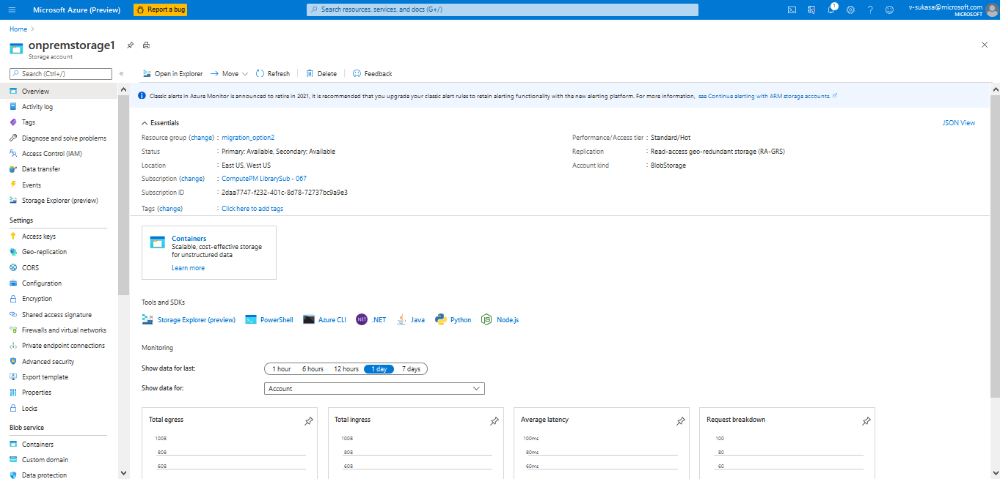

	- Select the Container, object checkboxes and set the start, expiry date of the SAS token. Click on "Generate SAS and Connection String".

  
	    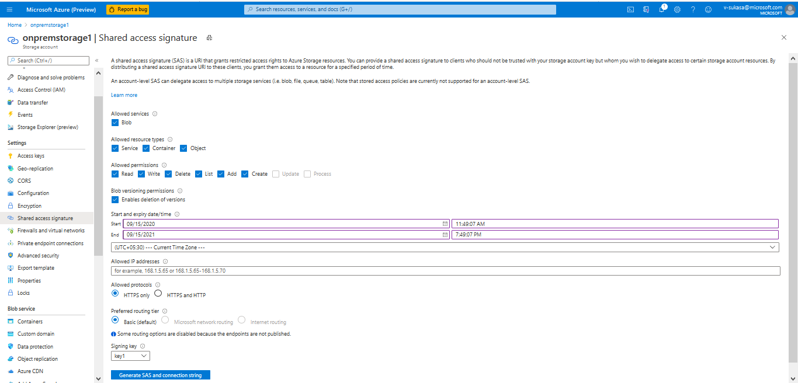

	- Copy and save the SAS token for further use.
	
	- Command to create a container in the storage account.

		```
		az storage container create --account-name <storageAccontName> --name <containerName> --auth-mode login
		Example: az storage container create --account-name onpremstorage1 --name migration --auth-mode login
		# --auth-mode login means authentication mode as login, after login the container will be created.
		```
        

    - Container can be created using Azure Portal, Navigate to the same storage account created and click on container and click on Add button.
	- After giving the mandatory container name, click on create button.
	    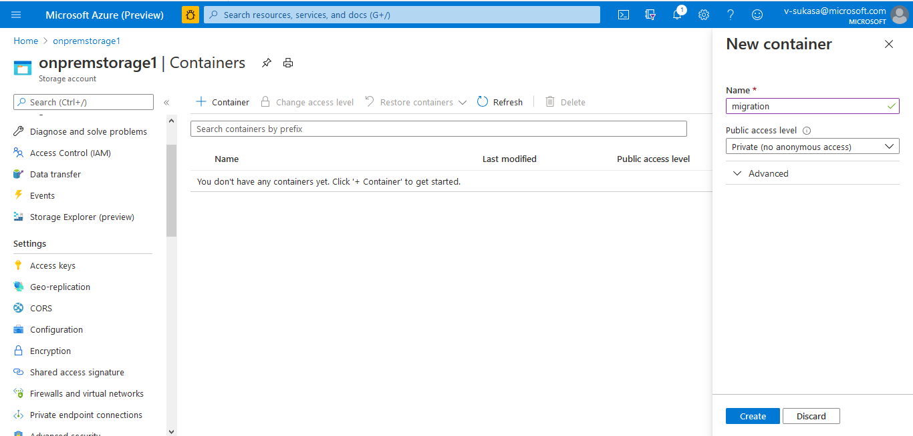


	- Command to copy archive file to blob storage.
        ```
        sudo azcopy copy '/home/azureadmin/storage.tar.gz' 'https://<storageAccountName>.blob.core.windows.net/<containerName>/<SAStoken>
        Example: azcopy copy '/home/azureadmin/storage.tar.gz' 'https://onpremstorage1.blob.core.windows.net/migration/?sv=2019-12-12&ss='
        ```
		
	- Now, you should have a copy of your archive inside the Azure blob storage account.
	 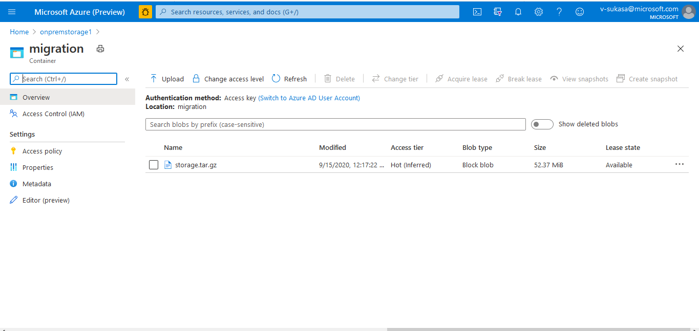


  

-  ## Migration
-  **Resources Creation**
	- To install the infrastructure for Moodle, navigate to the [azure portal](portal.azure.com) and select the created Resource Group.
	- Create the infrastructure by adding the resources.

  

-  **Creating Resources to host the Moodle application**

-  **Network Resources:**
- **Virtual Network**
	- An Azure Virtual Network is a representation of your own network in the cloud. It is a logical isolation of the Azure cloud dedicated to your subscription. When you create a VNet, your services and VMs within your VNet can communicate directly and securely with each other in the cloud. More information on [Virtual Network](https://docs.microsoft.com/en-us/azure/virtual-network/virtual-networks-overview).
	- you can create using Azure CLI command.

  

		```
		az network vnet create --name myVirtualNetwork --resource-group myResourceGroup --subnet-name default
		ex: az network vnet create --name migrationvnet --resource-group migration_option2 --subnet-name 
		```

	- Alternatively virtual network can be created using Azure Portal.
	- Navigate to the above created resource group, select Add to a resource. From the Azure Marketplace, select Networking > Virtual network.
	- In Create virtual network, for Basics section provide this information:

  
		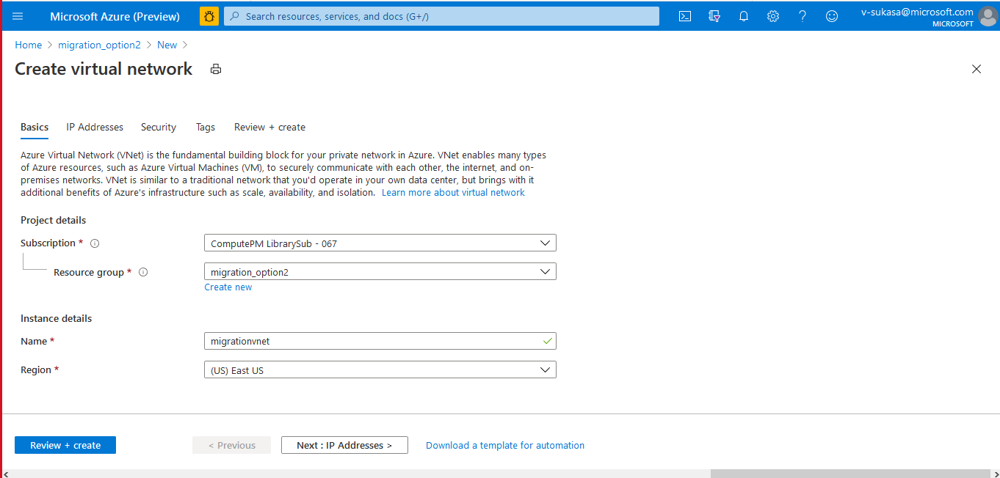

	 - Subscription: Select the same subscription created or used in above steps.
	- Resource Group: Select same resource group as migration_option2
	- Name: Give the instance name ex:migrationvnet.
	- Region: Select default region as eastus
	- Select Next: IP Addresses, and for IPv4 address space, enter 10.1.0.0/16.
	- Select Add subnet, then select the default address name and select Subnet name 
	- Then create a subnet in the Virtual Network using Azure CLI command

  

		```
		az network vnet subnet create -g MyResourceGroup --vnet-name MyVnet -n MySubnet --address-prefixes 10.0.0.0/24 --network-security-group MyNsg --route-table MyRouteTable

		ex: az network vnet subnet create -g migration_option2 --vnet-name migrationvnet -n MySubnet --address-prefixes 10.0.0.0/24 --network-security-group MyNsg --route-table MyRouteTable
		```

  
	- Select Add, then select Review + create. Leave the rest parameters as default and select Create.
	- For more Details on [virtual network](https://docs.microsoft.com/en-us/azure/virtual-network/quick-create-portal)

  

 -  **Network Security Group:**
	- A network security group (NSG) is a networking filter (firewall) containing a list of security rules allowing or denying network traffic to resources connected to Azure VNets. For more information [Network security group](https://docs.microsoft.com/en-us/azure/virtual-network/security-overview).
	- One option is to create network security group using Azure Portal.
	- Navigate to same resource group, Click on Add resource and select network security group.
	- Give the instance details such as name and region to create network security group.
	
	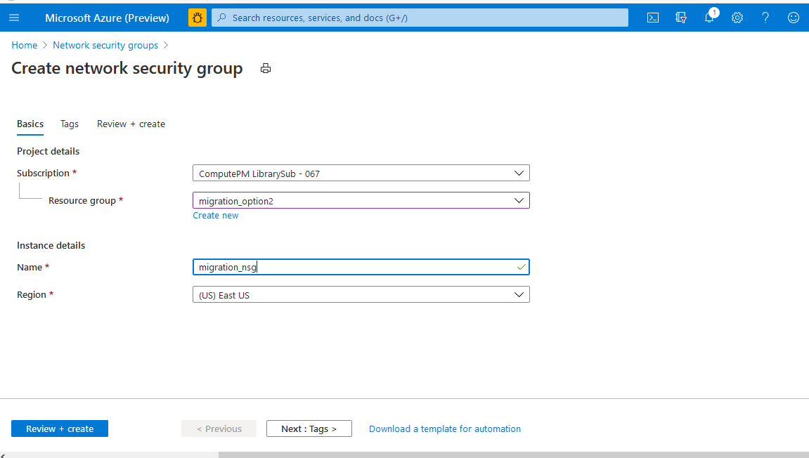
	- You can create a network security group using Azure CLI

	```
		az network nsg create --resource-group myResourceGroup --name myNSG

		ex: az network nsg create --resource-group migration_option2 --name migration_nsg
	```

-  **Network Interface:**
	- A network interface enables an Azure Virtual Machine to communicate with internet, Azure, and on-premises resources.
	- One option is to create network interface using Azure Portal.
	- Navigate to same resource group, Click on Add resource and select network interface.
	- Give the instance details such as name and region and fill the other mandatory details.
	
	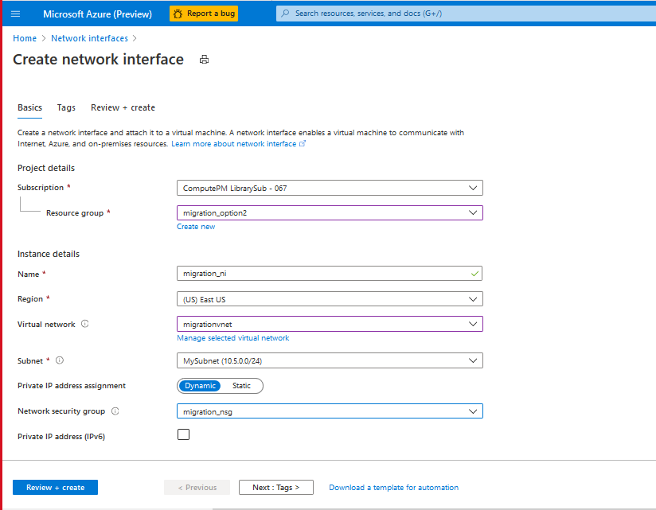
	- Create Network Interface with Azure CLI command

  

		```
		az network nic create --resource-group myResourceGroupLB --name myNicVM1 --vnet-name myVNet --subnet myBackEndSubnet --network-security-group myNSG

		ex: az network nic create --resource-group migration_option2 --name migration_ni --vnet-name migrationvnet --subnet MySubnet --network-security-group migration_nsg

		```

  
-  **Load Balancer:**
	- An Azure load balancer is a Layer-4 (TCP, UDP) load balancer that provides high availability by distributing incoming traffic among healthy VMs. A load balancer health probe monitors a given port on each VM and only distributes traffic to an operational VM. For more details on [Load balancer](https://docs.microsoft.com/en-us/azure/load-balancer/tutorial-load-balancer-standard-internal-portal)
	- One option is to create Load Balancer using Azure Portal.
	- Navigate to same resource group, Click on Add resource and select Load balancer.
	- Give the instance details such as name and region.
	- Give the type as public and sku as standard
	- For the public Ip address create a new IP address and give the name.
	- After filling the details. Click on review and create.
	
		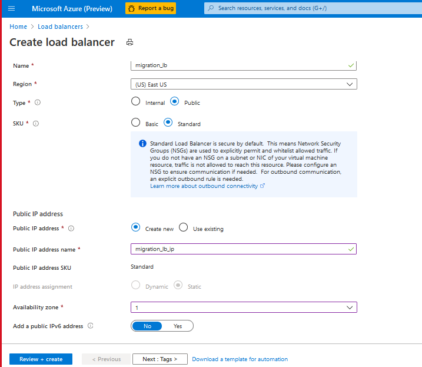
        - Alternatively, Load balancer can be created using Azure CLI commands.  
  

		```
		#Create a public IP
		az network public-ip create --resource-group myResourceGroupLB --name myPublicIP --sku Standard

		ex: az network public-ip create --resource-group migration_option2 --name migration_lb_ip --sku Standard

		#Create Load balancer
		az network lb create --resource-group myResourceGroupLB --name myLoadBalancer --sku Standard --public-ip-address myPublicIP --frontend-ip-name myFrontEnd --backend-pool-name myBackEndPool

		ex: az network lb create --resource-group migration_option2 --name migration_lb --sku Standard --public-ip-address migration_lb_ip --frontend-ip-name myFrontEnd --backend-pool-name myBackEndPool
		```

  

  -  **Azure Application GateWay**
		- An Azure Application Gateway is a web traffic load balancer that enables you to manage traffic to your web applications. Traditional load balancers operate at the transport layer (OSI layer 4 - TCP and UDP) and route traffic based on source IP address and port, to a destination IP address and port. For more details on [Azure application gateway](https://docs.microsoft.com/en-us/azure/application-gateway/overview).
		- To deploy the Application gate way from [Azure Portal](https://docs.microsoft.com/en-us/azure/application-gateway/quick-create-portal).

	 	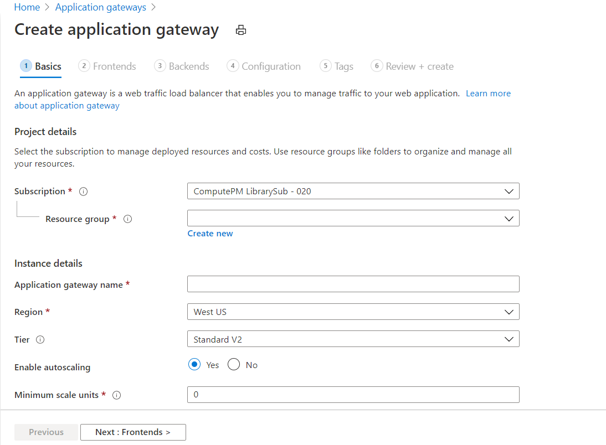

	  - To deploy the Application gate way from [Azure CLI](https://docs.microsoft.com/en-us/azure/application-gateway/quick-create-cli)

		  *Note:* Azure Application Gateway is optional, this migration document supports only Azure Load Balancer.

  

-  **Storage Resources**
	* An Azure storage account contains all of your Azure Storage data objects: blobs, files, queues, tables, and disks. The storage account provides a unique namespace for your Azure Storage data that is accessible from anywhere in the world over HTTP or HTTPS
	* Storage account will have specific type, replication, Performance, Size. For more details on [Storage account](https://docs.microsoft.com/en-us/azure/storage/common/storage-account-overview).
	* The types of storage accounts are General-purpose V2, General-purpose V1, BlockBlobStorage, File Storage, BlobStorage accounts. For more information on [types of storage account](https://docs.microsoft.com/en-us/azure/storage/common/storage-account-overview#types-of-storage-accounts)
	- Replication types are Locally-redundant storage (LRS), Zone-redundant storage (ZRS), Geo redundant storage (GRS). For more details on[replication types](https://docs.microsoft.com/en-us/azure/storage/common/storage-redundancy).
	- Standard- A standard performance tier for storing blobs, files, tables, queues, and Azure virtual machine disks.
	- Premium- A premium performance tier for storing unmanaged virtual machine disks.
	- Size(sku): A single storage account can store up to 500 TB of data and like any other Azure service. For more details on [size types](https://docs.microsoft.com/en-us/rest/api/storagerp/srp_sku_types).
	- Creating storage account with Azure Files Premium below should be the mandatory parameters.
	- Replication is Premium Locally-redundant storage (LRS)
	- Type is File Storage
	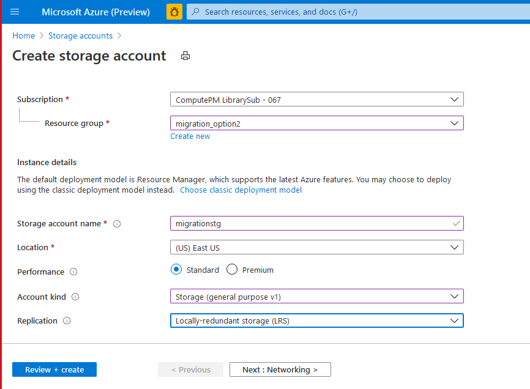
	- Azure CLI command to create storage account

  

		```
		az storage account create -n storageAccountName -g resourceGroupName --sku Standard_LRS --kind StorageV2 -l eastus2euap -t Account
		```

	- To access the containers and file share etc. navigate to storage account in resource group in the portal.

  
		

  -  **Database Resources** -

	  - Creates an [Azure Database for MySQL server](https://docs.microsoft.com/en-in/azure/mysql/).
	  -  Azure Database for MySQL is easy to set up, manage and scale. It automates the management and maintenance of your infrastructure and database server, including routine updates,backups and security. Build with the latest community edition of MySQL, including versions 5.6, 5.7 and 8.0.
	  - One option is to create Database using Azure Portal.
	  - Navigate to same resource group, Click on Add resource and select Azure Database for MySQL server .
	  - Give the instance details such as name and region and fill the other mandatory details such as servername,login name and password.
	  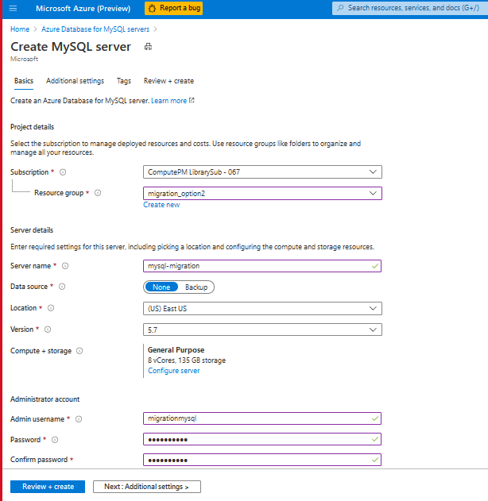
	  
	  - Alternatively, database can be created using Azure CLI commands
  

		```
		az mysql server create --resource-group myresourcegroup --name mydemoserver --location westus --admin-user myadmin --admin-password <server_admin_password> --sku-name GP_Gen5_2

		ex: az mysql server create --resource-group migration_option2 --name mysql-migration --location eastu --admin-user myadmin --admin-password <server_admin_password> --sku-name GP_Gen5_2
		```
-  **Configure firewall:**
	- Azure Databases for MySQL are protected by a firewall. By default, all connections to the server and the databases inside the server are rejected. Before connecting to Azure Database for MySQL for the first time, configure the firewall to add the client machine's public network IP address (or IP address range).

  

		```
		az mysql server firewall-rule create --resource-group myresourcegroup --server mydemoserver --name AllowMyIP --start-ip-address 192.168.0.1 --end-ip-address 192.168.0.1
		```
	- Click your newly created MySQL server, and then click Connection security.

	  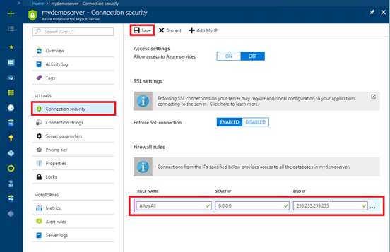

	 - You can Add My IP, or configure firewall rules here. Click on save after you have created the rules.

  - You can now connect to the server using mysql command-line tool or MySQL Workbench GUI tool.

  

-  **Get connection information:**
	- From the MySQL server resource page, note down Server Name and Server admin login name. You may click the copy button next to each field to copy to the clipboard.

	  

	 - For example, the server name is mydemoserver.mysql.database.azure.com, and the server admin login is myadmin@mydemoserver.

  

-  **Virtual Machine**
	- A virtual machine is a computer file, typically called an image, which behaves like an actual compute [Virtual machine](https://azure.microsoft.com/en-in/overview/what-is-a-virtual-machine/).
	- Before creating Virtual machine create an SSH key pair.
	- To generate [SSH keys](https://docs.microsoft.com/e1n-us/azure/virtual-machines/linux/create-ssh-keys-detailed).

	- If you already have an SSH key pair, you can skip this step.

	- Go to the PuTTY installation folder (the default location is C:\Program Files\PuTTY) and run: puttygen.exe

	- In the PuTTY Key Generator window, set Type of key to generate to RSA, and set Number of bits in a generated key to 2048.

	  

  
	
	- Select Generate.

	- To generate a key, in the Key box, move the pointer randomly.

	- When the key generation has finished, select Save public key, and then select Save private key to save your keys to files.

  
		

	- The public and private key is generated

-  **Creating Virtual Machine**
	- Create a VM with ubuntu 16.04 operating system with SSH public key
	- Select the default subscription and same resource group and give name for virtual machine.
	- Keep the availability options as default.
	- Select the Image of the virtual machine and Select the disk size.
	- Select Authentication type SSH, give the username give the SSH key generated in previous step.
	- Select the inbound rule for SSH as 22 and HTTP as 80.
	- Click next on Disk section.
	- Select the OS disk type. There are 3 choices Standard SSD, Premium SSD, Standard HDD
	- Keep the other parameters as default.
	- Click next on networking and select the virtual network created in above step and the public IP and keep the above parameters as default.
	- Click on next for management and keep the parameters as default.
	- Keeping the other parameters as default Click on review and create.
	 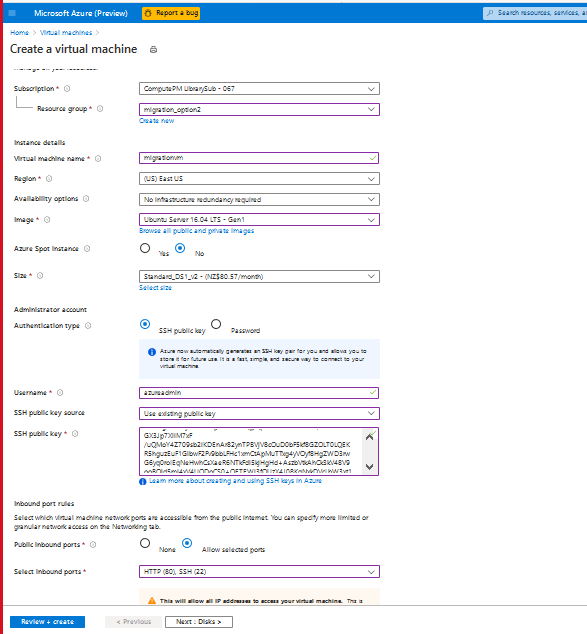
	- Alternatively Virtual Machine can be created using AZ CLI command

  

		```
		az vm create --resource-group myResourceGroup --name myVM --image UbuntuLTS --admin-username azureuser --authentication-type ssh --generate-ssh-keys

		ex: az vm create --resource-group migration_option2 --name igrattionvm --image UbuntuLTS --admin-username azureadmin --authentication-type ssh --generate-ssh-keys
		```

	 - Login into this controller machine using any of the free open-source terminal emulator or serial console tools.
	- Copy the public IP of controller VM and paste as host name and expand SSH in navigation panel and click on Auth and browse the same SSH key file given while deployment. Click on Open and it will prompt to give the username as azureadmin same as given while deployment that is azureadmin
	 - [Putty general FAQ/troubleshooting questions](https://documentation.help/PuTTY/faq.html).


  
		
	 	

  

  
  

# Install Moodle

 -  **Install prerequisites for Moodle**.
	- To install prerequisites for Moodle run the following commands
	
	- If you are installing PHP greater than or equal to 7.2 then upgrade ppa package
		```
		sudo -s
		sudo add-apt-repository ppa:ondrej/php -y > /dev/null 2>&1
		sudo apt-get update > /dev/null 2>&1
		```
	-	Update and install rsyslog, unzip, mysql-client, php and php extensions.
		```
		sudo apt-get -y update
		sudo apt-get -y install unattended-upgrades
		sudo apt-get -y install python-software-properties unzip rsyslog
		sudo apt-get -y install mysql-client git
		sudo apt-get -y install php$phpVersion
		```

	 - Install Php extensions and varnish.
	 	```
		# set php version to a variable 
		phpVersion=`/usr/bin/php -r "echo PHP_VERSION;" | /usr/bin/cut -c 1,2,3`
		echo $phpVersion

		sudo apt-get -y install varnish php$phpVersion php$phpVersion-cli php$phpVersion-curl php$phpVersion-zip php-pear php$phpVersion-mbstring php$phpVersion-dev mcrypt
		sudo apt-get -y --force-yes install php$phpVersion-fpm
		sudo apt-get install -y --force-yes graphviz aspell php$phpVersion-common php$phpVersion-soap php$phpVersion-json php$phpVersion-redis
		sudo apt-get install -y --force-yes php$phpVersion-bcmath php$phpVersion-gd php$phpVersion-xmlrpc php$phpVersion-intl php$phpVersion-xml php$phpVersion-bz2 
		```

	- Install Missing PHP extensions.
		- ARM template install the following PHP extensions 
			- fpm, cli, curl, zip, pear, mbstring, dev, mcrypt, soap, json, redis, bcmath, gd, mysql, xmlrpc, intl, xml and bz2.
		- To know the PHP extensions which are installed on on-premises run the below command on on-premises virtual machine to get the list.
			```
			php -m
			```
		- Note: If on-premises has any additional PHP extensions which are not present in Controller Virtual Machine can be installed manually.
			```
			sudo apt-get install -y php-extensionName
			```
	- PHP with 7.2 and higher versions are installing apache2 by default.
		- This documentation will support only nginx and if apache is installed then mask the apache service.
		- Check the apache service is installed by below command.
			```
			apache2 -v
			```
		- If the apache service is installed it will show up the service version, so you can identify that apache service is installed.
		- Run the below commands to mask the apache2 service.
			```
			sudo systemctl stop apache2
			sudo systemctl mask apache2
			```	
	- Install nginx webserver
		```
		sudo apt-get -y --force-yes install nginx
		```
	-   Install Azure CLI on a host inside the on-premises infrastructure for all Azure related tasks.
		```
		curl -sL https://aka.ms/InstallAzureCLIDeb | sudo bash
		```

  -  **Create Moodle Shared folder**
		- Create a moodle shared folder to install Moodle (/moodle)
			```
			mkdir -p /moodle
			mkdir -p /moodle/moodledata
			mkdir -p /moodle/html
			mkdir -p /moodle/certs
			```

	  - Mount shared [moodle folder with storage account](https://github.com/asift91/Manual_Migration/blob/master/azurefiles.md) for more information.

  -  **Download On-Premises archive file**
		- Download the On-Premises archived data from Azure Blob storage to VM such as Moodle, Moodledata, configuration folders with database backup file to /home/azureadmin location

  -  **Download and Install AzCopy:**
		
		- Execute the below commands to install Az Copy
			
			```

			sudo -s

			wget https://aka.ms/downloadazcopy-v10-linux

			tar -xvf downloadazcopy-v10-linux

			sudo rm /usr/bin/azcopy

			sudo cp ./azcopy_linux_amd64_*/azcopy /usr/bin/

			```

		- Download storage.tar.gz file from the blob storage. The path to download will be /home/azureadmin.

		```
		cd /home/azureadmin 
		azcopy copy 'https://storageaccount.blob.core.windows.net/container/BlobDirectory/*' 'Path/to/folder'
		```
		- Extract archive storage.tar.gz file

		```
		tar -zxvf yourfile.tar.gz
		ex: tar -zxvf storage.tar.gz
		```

		- Storage folder contains Moodle, Moodledata and configuration folders along with database backup file.

  
 -  **Migrate On-Premises Moodle:**
	- Create a backup folder

  
		
		```
		cd /home/azureadmin/
		mkdir -p backup
		```

  

	- Copy and replace moodle folder with On-Premises moodle folder

		  

		```
		cd /home/azureadmin/
		cp -rf storage/moodle /moodle/html/moodle
		```

	 - Replace the moodledata folder
	- Copy and replace this moodledata (/moodle/moodledata) folder with existing folder
	- Copy the moodledata folder existing path

  

		```
		cd /home/azureadmin/
		cp -rf storage/moodledata /moodle/moodledata
		```

  

-  **Configuring permissions**
	- Set the Moodle and Moodledata folder permissions.
	- Set 755 and www-data owner:group permissions to Moodle folder

  
		
		```
		sudo chmod 755 /moodle
		sudo chown -R www-data:www-data /moodle
		```

	 - Set 770 and www-data owner:group permissions to Moodledata folder

  

		```
		sudo chmod 755 /moodle/moodledata
		sudo chown -R www-data:www-data /moodle/moodledata
		```

  

-  **Importing Database**
	- Import the database from a backup file to a new database created in Azure Database for MySQL.
	- Before creating database install mysql-clinet on controller VM.

  

		```
		sudo apt install mysql-client
		```

	- A database needs to be created prior to the import.

  

		```
		mysql -h $server_name -u $ server_admin_login_name -p$admin_password -e "CREATE DATABASE ${moodledbname} CHARACTER SET utf8;"
		```

	  Note: User can get the Database servername, admin login, password from the azure portal, select the created Azure Database for MySQL.

  - Change the permissions.

	  ```
		mysql -h $ server_name -u $ server_admin_login_name -p${admin_password } -e "GRANT ALL ON ${moodledbname}. * TO ${moodledbuser} IDENTIFIED BY '${moodledbpass}';"
    ```

  - Import the database.

  

		```
		mysql -h db_server_name -u db_login_name -pdb_pass dbname >/home/azureadmin/storage/database.sql
		```

  - Change the database details in moodle configuration file (/moodle/config.php).
- Update the following parameters in config.php
- dbhost, dbname, dbuser, dbpass, dataroot and wwwroot


  

	```
	cd /moodle/html/moodle/
	vi config.php
	# update the database details and save the file.
	```
- [Database general FAQ/troubleshooting questions](https://docs.azure.cn/en-us/mysql-database-on-azure/mysql-database-tech-faq)

  

-  **Configuring Php & WebServer**
	- Update the nginx conf file
		```
		sudo mv /etc/nginx/sites-enabled/<dns>.conf /home/azureadmin/backup/
		cd /home/azureadmin/storage/configuration/nginx
		sudo cp <dns>.conf /etc/nginx/sites-enabled/

		 ```
	- Update the apache conf file
				
	```
		sudo mv /etc/apache/sites-enabled/<dns>.conf /home/azureadmin/backup/
		cd /home/azureadmin/storage/configuration/apache
		sudo cp <dns>.conf /etc/apache/sites-enabled/
	```

	  - Update the php config file

  

	```
	sudo mv /etc/php/<phpVersion>/fpm/pool.d/www.conf /home/azureadmin/backup
	sudo cp /home/azureadmin/storage/configuration/www.conf /etc/php/<phpVersion>/fpm/pool.d/
	```

	  - Restart the web servers

	```
	sudo systemctl restart nginx
	sudo systemctl restart php(phpVersion)-fpm
	ex: sudo systemctl restart php7.4-fpm
	```

  
-  **Scale Set:**
	- A virtual machine scale set allows you to deploy and manage a set of auto-scaling virtual machines. You can scale the number of VMs in the scale set manually or define rules to auto scale based on resource usage like CPU, memory demand, or network traffic. An Azure load balancer then distributes traffic to the VM instances in the scale set. For more information on [Scaleset](https://docs.microsoft.com/en-us/azure/virtual-machine-scale-sets/quick-create-portal).
	- Create a scale set in same resource group.
	- Prerequisites is the to create a public Standard Load Balancer.
	- User can create Azure Application Gateway. For more information [Application Gateway](https://docs.microsoft.com/en-us/azure/application-gateway/overview).
	- The name and public IP address created are automatically configured as the load balancer's front end.
	- Scale set creates an VM instance with Ubuntu 16.04 OS.
	- Search Virtual machine scale sets. Select Create on the Virtual machine scale sets page, which will open the Create a virtual machine scale set page.
	- In the Basics tab, under Project details, select the subscription and then choose to same resource.
	- Type name as the name for your scale set.
	- In Region, select the same region.
	- Leave the default value of Scale Set VMs for Orchestration mode.
	- Enter your desired username and select which authentication type as SSH and give the same SSH key and username as azureadmin.
	- Select the image or browse the image for the scale set
	- Select the size for the disk.
	- Click Next for the disk tab select the OS disk type as per choice
	- Click Next for the networking section
	- Select the created virtual network.
	- Give the instance count and the scaling policy as manual or custom.
	- set the rules to scale up/down a VM based on the average cpu percentage.
	- Select Next and keep the other things as default.
	- Click on review and create and the scale set.
	- Scale set can be created from Azure CLI

  

		```
		az vmss create -n MyVmss -g MyResourceGroup --public-ip-address-dns-name my-globally-dns-name --load-balancer MyLoadBalancer --vnet-name MyVnet --subnet MySubnet --image UbuntuLTS --generate-ssh-keys
		```

	 
	- VMSS will create a VM instance with an internal IP. User need to have a VPN gateway to access the VM.
	- To setup the Virtual Network Gateway access the [document](https://github.com/asift91/Manual_Migration/blob/master/vpngateway.md).

  
-  **Configuring VMSS**

-  **Download install_prerequisites.sh script**.
	- Install Moodle prerequisites in VMSS instance same as controller VM.
	- Install web server (nginx/apache) with the given version
	- Install PHP with its extensions.
	-  *Note:* Use same commands as controller VM to install PHP and Webserver.
-  **Create Moodle Shared Folder**
	- Create a moodle shared folder (/moodle)
		```
		mkdir -p /moodle
		mkdir -p /moodle/moodledata
		mkdir -p /moodle/html
		mkdir -p /moodle/certs
		```

  

-  **Mounting File Share**
	- Mount Azure File share in VM instance
	- Follow the [documentation](https://github.com/asift91/Manual_Migration/blob/master/azurefiles.md) to set the Azure File Share on VMSS

  

-  **Download On-Premises archive file**
	- Download the On-Premises archived data from Azure Blob storage to VM such as Moodle, Moodledata, configuration folders with database backup file to /home/azureadmin location
	- Download storage.tar.gz file from the blob storage. The path to download will be /home/azureadmin.

  

		```
		sudo -s
		cd /home/azureadmin
		azcopy copy 'https://storageaccount.blob.core.windows.net/container/BlobDirectory/*' 'Path/to/folder'
		```

  
	- Extract archive storage.tar.gz file
		```
		tar -zxvf yourfile.tar.gz
		ex: tar -zxvf storage.tar.gz
		```

  

-  **Configuring Php & WebServer**
	- Update nginx configuration file (/moodle/config.php)

		```
		mkdir -p /home/azureadmin/backup/
		sudo mv /etc/nginx/sites-enabled/<dns>.conf /home/azureadmin/backup/
		cd /home/azureadmin/storage/configuration/
		sudo cp <dns>.conf /etc/nginx/sites-enabled/
		```

  

	- Update the php config file

		```
		sudo mv /etc/php/<phpVersion>/fpm/pool.d/www.conf /home/azureadmin/backup
		sudo cp /home/azureadmin/storage/configuration/www.conf /etc/php/<phpVersion>/fpm/pool.d/
		sudo systemctl restart nginx
		sudo systemctl restart php(phpVersion)-fpm
		ex: sudo systemctl restart php7.4-fpm

		```

  -  **Set a cron job**

		- A cron job will be set to update a local copy of /moodle/html/ to webroot directory (/var/www/html/) by updating a time stamp.

		- Cron job will run for every minute, It will check for time stamp update and local copy of VMSS get updated.
	-  *Setup Cron Job:*

  
		
		```
		local SYNC_SCRIPT_FULLPATH="/usr/local/bin/sync_moodle_html_local_copy_if_modified.sh"
		mkdir -p $(dirname ${SYNC_SCRIPT_FULLPATH})
		local SYNC_LOG_FULLPATH="/var/log/moodle-html-sync.log"
		cat <<EOF > ${SYNC_SCRIPT_FULLPATH}

		 #!/bin/bash
		sleep \$((\$RANDOM%30))
		if [ -f "$SERVER_TIMESTAMP_FULLPATH" ]; then
		SERVER_TIMESTAMP=\$(cat $SERVER_TIMESTAMP_FULLPATH)
		if [ -f "$LOCAL_TIMESTAMP_FULLPATH" ]; then
		LOCAL_TIMESTAMP=\$(cat $LOCAL_TIMESTAMP_FULLPATH)
		else
		logger -p local2.notice -t moodle "Local timestamp file ($LOCAL_TIMESTAMP_FULLPATH) does not exist. Probably first time syncing? Continuing to sync."
		mkdir -p /var/www/html
		fi
		if [ "\$SERVER_TIMESTAMP" != "\$LOCAL_TIMESTAMP" ]; then
		logger -p local2.notice -t moodle "Server time stamp (\$SERVER_TIMESTAMP) is different from local time stamp (\$LOCAL_TIMESTAMP). Start syncing..."
		if [[ \$(find $SYNC_LOG_FULLPATH -type f -size +20M 2> /dev/null) ]]; then
		truncate -s 0 $SYNC_LOG_FULLPATH
		fi
		echo \$(date +%Y%m%d%H%M%S) >> $SYNC_LOG_FULLPATH
		rsync -av --delete /moodle/html/moodle /var/www/html >> $SYNC_LOG_FULLPATH
		fi
		else
		logger -p local2.notice -t moodle "Remote timestamp file ($SERVER_TIMESTAMP_FULLPATH) does not exist. Is /moodle mounted? Exiting with error."
		exit 1
		fi
		EOF
		chmod 500 ${SYNC_SCRIPT_FULLPATH}
		local CRON_DESC_FULLPATH="/etc/cron.d/sync-moodle-html-local-copy"
		cat <<EOF > ${CRON_DESC_FULLPATH}
		* * * * * root ${SYNC_SCRIPT_FULLPATH}
		EOF
		chmod 644 ${CRON_DESC_FULLPATH}
		# Addition of a hook for custom script run on VMSS from shared mount to allow customised configuration of the VMSS as required
		local CRON_DESC_FULLPATH2="/etc/cron.d/update-vmss-config"
		cat <<EOF > ${CRON_DESC_FULLPATH2}
		* * * * * root [ -f /moodle/bin/update-vmss-config ] && /bin/bash /moodle/bin/update-vmss-config
		EOF
		chmod 644 ${CRON_DESC_FULLPATH2}
		```

		- Moodle site has a cron job. It is scheduled for once per minute. It can be changed as needed.

```
	echo '* * * * * www-data /usr/bin/php /moodle/html/moodle/admin/cli/cron.php 2>&1 | /usr/bin/logger -p local2.notice -t moodle' > /etc/cron.d/moodle-cron
```

-  **Restart Servers**
	- Restart nginx server & php-fpm server
		```
		sudo systemctl restart nginx
		sudo systemctl restart php(phpVersion)-fpm
		```
	- With the above steps Moodle infrastructure is ready.

  -  **Log Paths**
		- On-Premises might be having different log path location and those paths need to be updated with Azure log paths.
		- TBD Need to be check how to configure log paths in Azure.
-  **Restart servers**
	- Update the time stamp to update the local copy in VMSS instance.

		```
		/usr/local/bin/update_last_modified_time.azlamp.sh
		```

	- Restart the nginx and php-fpm servers

		```
		sudo systemctl restart nginx
		sudo systemctl restart php<phpVersion>-fpm
		```

  

## Post Migration
- Post migration of Moodle application user need to update the certs and log paths as follows
-  **Virtual Machine:**

	 - Go to Controller VM and update the log paths, SSL Certificates, update time stamp and restart servers.
-  **Log Paths**
	- On-Premises might be having different log path location and those paths need to be updated with Azure log paths.
	- nginx log path are defaulted to /var/log/nginx.
	- access.log and error.log are created.
-   **Certs:**
	-   *SSL Certs*: The certificates for your Moodle application reside in /moodle/certs/
	- Copy over the .crt and .key files over to /moodle/certs/. The file names should be changed to nginx.crt and nginx.key in order to recognize by the configured nginx servers. Depending on your local environment, you may choose to use the utility scp or a tool like WinSCP to copy these files over to the cluster controller virtual machine.
	- You can also generate a self-signed certificate, useful for testing only:

  

		```
		openssl req -x509 -nodes -days 365 -newkey rsa:2048 -keyout /moodle/certs/nginx.key -out /moodle/certs/nginx.crt -subj "/C=US/ST=WA/L=Redmond/O=IT/CN=mydomain.com"
		```
	- It's recommended that the certificate files be read-only to owner and that these files are owned by www-data:

  

		```
		chown www-data:www-data /moodle/certs/nginx.*
		chmod 400 /moodle/certs/nginx.*
		```

 -  **Restart servers:**
	- Restart the nginx and php-fpm servers

  
		
		```
		sudo systemctl restart nginx
		sudo systemctl restart php<phpVersion>-fpm
		```

  

-  **Update Time Stamp:**
	- A cron job is running in the VMSS which will check the updates in time stamp for every minute. If there is an update in time stamp then local copy of VMSS (/var/www/html/moodle) is updated from shared folder (/moodle/html/moodle).
	- Update the time stamp to update the local copy in VMSS instance.

  

		```
		/usr/local/bin/update_last_modified_time.azlamp.sh
		```

  

-  **Set Rules**
	- Set the Load Balancing rules and Auto Scaling rules.
-  **Load Balancing Rules**
	- Go to the Load Balancer Resource in Azure portal.
	- Set the http (TCP/80) and https (TCP/443) rules.
		```
		az network lb rule create --resource-group myResourceGroupLB --lb-name myLoadBalancer --name myHTTPRule --protocol tcp --frontend-port 80 --backend-port 80 --frontend-ip-name myFrontEnd --backend-pool-name myBackEndPool --probe-name myHealthProbe --disable-outbound-snat true
		```

  

-  **Auto Scaling Rules**
	- Go to the Virtual Machine Scale Set Resource in Azure portal.
	- In Scaling section, add a scale condition, user can add a rule to scale up and scale down an instance based up on the VM load.

  

		```
		# Auto scaling rules can be created by scaling precentage or by the scaling count.
		az monitor autoscale rule create -g {myrg} --autoscale-name {myvmss} \
		--scale to 5 --condition "Percentage CPU > 75 avg 10m"
		# Scale to 5 instances when the CPU Percentage across instances is greater than 75 averaged over 10 minutes.
		az monitor autoscale rule create -g {myrg} --autoscale-name {myvmss} \
		--scale in 50% --condition "Percentage CPU < 25 avg 15m"
		# Scale down 50% when the CPU Percentage across instances is less than 25 averaged over 15 minutes.
		```

  

-  **Mapping IP:**
	- Map the load balancer IP with the DNS name.
	-   Disable Moodle website from Maintenance mode.
         - Run the below commnad in Controller Virtual Machine.
              ```
                sudo /usr/bin/php admin/cli/maintenance.php --disable
             ```
         - To check the status of the moodle site run the below command.
             ```
                sudo /usr/bin/php admin/cli/maintenance.php
             ```
 	- Hit the load balancer DNS name to get the migrated moodle web page.
